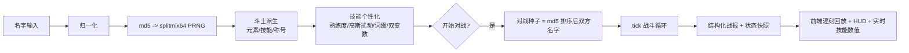
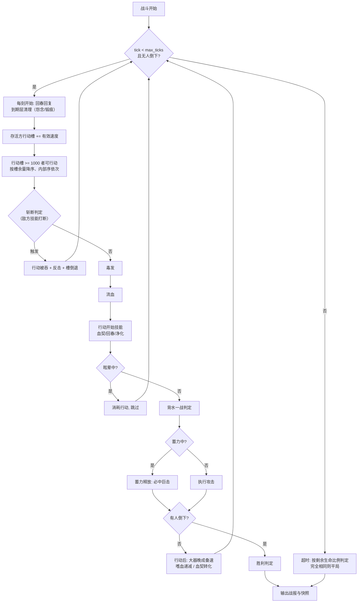

# 名字竞技场 · 完整规则与配置手册（GAME_SPEC）

> 本文档是游戏的**完整规则说明书**：流程图、全部细则与数值、每个 JSON 配置文件的
> 意义与调整指南。按 AGENTS.md 第 3.6 条，**每次更新涉及规则/数值/配置结构时必须
> 同步更新本文档**。当前版本：**v0.9.0**（与 `config/game/system.json` 的 `version` 一致）。

---

## 1. 总览

输入两个名字 → 名字 MD5 确定斗士的一切（元素/技能/称号/熟练度/变数）→ 以 tick
推进的确定性回合对战。核心契约：**名字 + 配置不变 ⇒ 派生与对战结果永远不变**
（与进程、机器、请求次数、输入顺序无关）。

v0.9.0 的三大设计支柱：

- **白板 100 基准**：生命/攻击/防御/速度的默认白板值一律为 100（称号与加成可超过
  100），战斗公式用 `atk_factor` / `defense_factor` / `gauge_threshold` 把面板值
  折算回与旧体系等价的实际当量——**数值实际不变，量纲归一**；
- **熟练度系统**：每个技能实例附带 0–100 的熟练度，按技能各自的区间缩放触发概率
  （条件触发型技能缩放效果值），取代 v0.8 的概率高斯扰动；
- **双变数共鸣**：每个技能有两个变数槽位，各以 **25%** 概率实际成为共鸣变数
  （公式括号紧跟对应数值），公式中属性以 **emoji 图标** 表示
  （❤️⚔️🛡️💨🎯🌀），去「当前」措辞。



---

## 2. 随机体系

### 2.1 名字归一化

| 规则 | 当前值（`game/system.json` → `name`） |
| --- | --- |
| 去除首尾空白 `trim` | `true` |
| 大小写折叠 `case_sensitive` | `false`（`Alice` ≡ `alice`） |
| 最小/最大长度 | 1 / 32 |

归一化后为空 → 400 `empty_name`；超长 → 400 `name_too_long`。内部空格保留。

### 2.2 数值精度（v0.8.0 起）

- **后台不取整、保留全浮点**：个性化参数、共鸣系数、伤害、吸血、毒伤、流血、
  回血、HP 全程浮点运算（离散计数如持续刻数仍为整数）；
- **展示层：百分数保留 2 位小数，其余数值保留整数**——
  `format_pct`（"13.02%"）/ `format_num`（"8"）；战报、HUD 与汇总同一规则
  （前端 `fmtPct` = `toFixed(2)+"%"`、`fmtInt` = `Math.round`）；
  快照中的 hp/atk/def/spd/crit/dodge/gauge/gauge_gain 四舍五入到 2 位（仅数据精度，
  不影响内部运算，前端展示时再取整）。

### 2.3 抽样规则

- **离散选择**（选哪个元素/技能/称号结构/字段/词缀/共鸣模式与变量）：加权均匀抽取；
- **数值抽样**（技能数量、熟练度、个性化扰动倍率、共鸣倍率、伤害浮动）：
  **高斯分布** `DetRng.next_gaussian(lo, hi)`——Box-Muller 变换（每次消耗两个
  均匀数），均值 = 区间中点，σ = 区间宽 ÷ 4，越界截断到区间；
  离散数值（技能数量）用 `next_gaussian_range`（±0.5 扩展后取整）。

### 2.4 派生主 PRNG 消耗顺序（固定，改变即 breaking）

种子：`md5(归一化名字)` → splitmix64。

1. 元素（加权抽取；仅身份标识，不影响数值）
2. 技能数量 k（**高斯**，[2, 3]）
3. 技能抽取（不放回加权，保持顺序）
4. 称号结构（加权）→ 称号字段（按结构顺序加权；core2 排除已用核心）
5. 称号字段加成叠加到固定属性（纯查表，不消耗随机数）
6. 战力 = Σ(属性 × 权重)

**属性为固定基础值（无随机）**；**稀有度系统已删除**（v0.5.0）。

---

## 3. 属性（`game/attributes.json`）—— 白板 100 基准（v0.9.0）

| 属性 | 基础值 base | 展示条范围 | 战力权重 | emoji（locale） |
| --- | --- | --- | --- | --- |
| hp 生命 | 100 | 80–120 | 1 | ❤️ |
| atk 攻击 | 100 | 80–120 | 0.5 | ⚔️ |
| def 防御 | 100 | 80–120 | 0.3 | 🛡️ |
| spd 速度 | 100 | 80–120 | 0.2 | 💨 |
| crit 暴击 | 12% | 5–20 | 2 | 🎯 |
| dodge 闪避 | 10% | 5–15 | 2 | 🌀 |

- `min/max` 仅用于卡牌进度条展示；实际值 = base + 称号加成（下限 1）；
  **在称号/技能加成下可超过 100**；
- crit/dodge 为概率属性，仍以百分数存储，不参与 100 基准；
- 白板战力 ≈ 244（hp100×1 + atk100×0.5 + def100×0.3 + spd100×0.2 + 暴12×2 + 闪10×2），
  与 v0.8 的 231 基本持平；
- **量纲折算**（`game/battle.json`）：`atk_factor` 0.13（白板 100 攻击 ≈ 旧 13 攻击
  当量）、`defense_factor` 0.05（100 防御 ≈ 旧 5）、`gauge_threshold` 1000
  （速度 100 ≈ 旧 10 的出手节奏）。技能中涉及攻/防/速的面板数值
  （破甲量 34、行动槽 260/450、大器晚成 +3.0 等）均已按新量纲标注。

元素池：烈焰/洪流/青木/惊雷 权重 1，圣光/暗影 0.8（纯装饰）。

---

## 4. 技能体系

### 4.1 技能池（`game/skills.json` → `skills`）

每名斗士不放回抽取 **2–3** 个（高斯，2 更常见）。触发时机：`on_attack` /
`on_defense` / `on_turn_start` / `passive`。v0.9.0 起共 **25** 个技能
（v0.8 的 27 个中删除 疾风步/心眼，重做 20 个，微调其余），数值经 6000 场
蒙特卡洛调参（`tools/balance_check.py`，持有者胜率 46.0%–56.2%）。

| 技能 | 触发 | 基础效果（白板值） | 熟练度区间 |
| --- | --- | --- | --- |
| 重击 heavy_strike | on_attack | 17% 概率蓄力（占一次行动）：下次行动必定命中、暴击+30、伤害 ×2.3 | ×0.55–1.65 |
| 斩杀 execution | on_attack | 38% 概率，敌方 HP≤35% 时伤害 ×2.9 | ×0.7–1.5 |
| 嗜血 bloodthirst | on_attack | 28% 概率获得 3 次行动内 40% 吸血 | ×0.75–1.35 |
| 淬毒之刃 venom | on_attack | 30% 概率中毒：每动 5 点，持续 12 刻 | ×0.8–1.3 |
| 眩晕重锤 stun_blow | on_attack | 18% 概率破防重击：该击无视 35% 防御，命中眩晕 6 刻 | ×0.6–1.55 |
| 雷罚 thunder | on_attack | 80% 概率替换攻击：连续真实伤害（每道攻击 24%，后续每道概率 ×0.93 衰减，至多 9 道） | ×0.85–1.15 |
| 斩断 sever | on_defense | 敌方即将行动时 15% 概率打断其回合并反击 ×0.6，其行动槽倒退 150 | ×0.65–1.5 |
| 疾影突袭 shadow_step | on_attack | 命中后 60% 概率行动槽 +260（暴击 +450） | ×0.7–1.45 |
| 千锤百炼 iron_hide | on_defense | 受击时 65% 概率叠锻痕：每层减伤 10%，持续 30 刻，无限叠 | ×0.8–1.25 |
| 荆棘反甲 thorns | on_defense | 受伤时 32% 概率免伤 18% 并以 ×1.25 反弹该部分 | ×0.7–1.4 |
| 坚守壁垒 bulwark | on_defense | HP≥60% 时受伤 −28%，且 9% 概率完全免疫 | 免疫 ×0.6–1.6 |
| 以牙还牙 retribution | on_defense | 受击时 30% 概率记录伤害（至多 6 条）：下次命中以 ×0.6 追加打出总和 | ×0.7–1.45 |
| 不屈意志 iron_will | passive | 致命伤 58% 概率回复 28% 生命；每次触发后概率 ×0.3 指数衰减 | ×0.5–1.5 |
| 回春术 spring_heal | on_turn_start | 18% 概率回复 6.5 点 + 回春印记（每 10 刻回 1.8 点，持续 30 刻） | ×0.75–1.4 |
| 净化 purify | on_turn_start | 38% 概率驱散双方所有标记与增益减益（每种回 3.6 点）+ 回 2.5 点 | ×0.7–1.5 |
| 背水一战 last_stand | passive | HP<35% 时攻击 +30%、速度 +28%（一次触发，持续到结束） | 效果 ×0.8–1.3 |
| 乘胜追击 momentum | on_attack | 命中时 80% 概率 +1 层（每层 +5%，至多 4 层），落空清零 | ×0.85–1.2 |
| 燃血轰击 overload | on_attack | 35% 概率消耗 12% 最大生命，本次伤害 ×2.2 | ×0.65–1.55 |
| 破甲连打 rupture | on_attack | 36% 概率击碎护甲：防御 −34（可叠 3 层），持续 16 刻 | ×0.75–1.35 |
| 撕裂 lacerate | on_attack | 32% 概率流血：每动损失攻击者攻击 26% 的生命，持续 12 刻 | ×0.75–1.35 |
| 孤注一掷 all_in | on_attack | 40% 概率伤害 ×2.2，否则 ×0.5 | ×0.7–1.5 |
| 大器晚成 late_bloom | passive | 每次行动后 80% 概率速度 +3.0，无上限叠加 | ×0.85–1.15 |
| 洞悉 true_sight | on_attack | 45% 概率该击无视全部防御且暴击 +20 | ×0.7–1.45 |
| 血契 blood_pact | on_turn_start | 40% 概率献祭 8% 最大生命：该次攻击 80% 吸血，行动后按吸血量 ×0.6 永久加攻击 | ×0.7–1.45 |
| 怨念深重 grudge | on_defense | 被命中时 55% 概率 +1 层怨念（持续 18 刻）：每层伤害 +5%，无上限 | ×0.75–1.4 |

调参记录（初版 → 终版）：撕裂首测 71.3%（流血误用面板攻击，修复量纲折算）；
重击首测 64.3% → 三轮下调（爆发伤害的胜率敏感度约为 EV 预期的 2 倍）；
斩断 65.3% → 54%；疾影突袭 35.3% → 47%；回春术 59.5% → 53%。

### 4.2 个性化（`md5(名字:技能id)` 独立种子）

消耗顺序固定（v0.9.0，改变即 breaking）：**熟练度 → value → damage →
前缀(是否→抽取) → 后缀(是否→抽取) → 变数槽一(是否→模式→变量→倍率) →
变数槽二(同前)**。

- **熟练度 `mastery`**：**高斯**抽样 0–100（集中于 50），按技能各自的
  `mastery: [lo, hi]` 区间换算为倍率 `mult = lo + (hi−lo)×熟练度/100`，
  作用于 `mastery_on` 字段（默认 `chance`；背水一战 `value` 同时缩放攻击与速度，
  坚守壁垒 `immune`）。概率截断 [2%, 95%]、免疫截断 [1%, 50%]；
- **方差扰动 `md5_variance`**（**高斯**，取代旧的概率扰动）：
  `value: [0.8, 1.3]` 缩放效果主参数（`damage` 字段同理）；
- **名称词缀 `name_modifiers`**：前缀 50% / 后缀 40%；词缀对技能**已有参数**做
  小幅加法修正，且**修正值按名字个性化高斯缩放**（`mod_variance` = [0.7, 1.3]）：

| 词缀 | 修正 | | 词缀 | 修正 |
| --- | --- | --- | --- | --- |
| 疾风(前) | 触发率 +3% | | 破军(后) | 效果值 +6% |
| 猛烈(前) | 效果值 +8% | | 蹈隙(后) | 触发率 +4% |
| 蚀骨(前) | 毒伤 +1 | | 入骨(后) | 毒伤 +1 |
| 缠绵(前) | 持续 +2 刻 | | 不息(后) | 持续 +2 刻 |
| 浩大(前) | 效果值 +5%、触发率 +2% | | 汹涌(后) | 效果值 +12%、触发率 -3% |

### 4.3 变数共鸣（v0.9.0 双槽位模型）

- 每个技能类型在 `variable_link.targets` 中声明 **1–2 个可共鸣字段**
  （依序为槽位一/槽位二，对应技能中两个不同的数值）；
- 每个槽位独立以 `chance = 25%` 的概率实际成为变数（技能级出现率 ≈ 44%，
  双变数率 ≈ 6%）；
- **模式**（`mode_weights`）：己方单值 own 10 / 敌方单值 enemy 3 /
  差值 difference 2 / 并值 sum 1——单值占绝对多数，己方优先；
- 变量池与倍率（**高斯**）不变：atk 3 / def 2 / spd 3 / hp 2 / crit 1 / dodge 1，
  归一化倍率 0.25–0.65；差值/并值参照（`diff_against`）：攻↔防、速↔速、命↔命、
  暴击↔闪避。

**共鸣计算**（触发时刻按当前值动态计算，不改变技能逻辑，只修正技能自身参数）：

```
coeff = rate × ( 变量式 ÷ 变量基础值 )
  own:        己方[变量]
  enemy:      敌方[变量]
  difference: 己方[变量] − 敌方[参照]        // 可为负
  sum:        己方[变量] + 敌方[参照]
最终参数 = 基础参数 × (1 + coeff)，按字段规格截断（RESONANCE_SPECS）
```

「当前值」：hp = 当前生命，atk = 含背水一战/血契转化，def = 破甲后有效防御，
spd = 含背水一战速度加成，crit/dodge = 面板。

### 4.4 技能描述（v0.9.0 格式）

- **描述 = 一句自然语言**，由 `locale/stats.json` 的 `nat_<效果类型>` 模板 +
  个性化真实数值生成，模板占位符与效果字段同名（`{chance}` `{value}` `{ticks}` 等）；
- **共鸣公式括号紧跟对应数值**（每技能至多 2 个）：
  「数值（基数 + 变量式*合并系数）」，合并系数 = 基数 × 倍率 ÷ 变量基础值。
  变量式用属性 **emoji**：own 省略范围词（`⚔️`）、enemy 前缀「对方」（`对方⚔️`）、
  差值/并值用【】包裹（`【己方-对方】⚔️` / `【己方+对方】⚔️`）；
  连接符为 `*`（如 `74.29% + ⚔️*6.84%`）；
- **尾句依赖描述**用属性全名：「己方攻击越高，效果值越高。」/
  「对方攻击越高…」/「己方攻击高于对方防御越多…」/「己方攻击与对方防御合计越高…」；
  不再使用「当前」措辞；
- **熟练度行**：技能名行右侧显示「熟练度 63：触发率 ×121.00%」
  （条件型为「效果 ×…」，`mastery_text` / `mastery_text_value` 模板）；
- **对战实时技能数据**：主句数值随双方当前快照逐刻变化（后端提供 `live_text`
  （每个共鸣数值位为 `\u0001` 标记，至多 2 个）与
  `link_calc = [{field, fmt, base, coeff, mode, variable, against, clamp}, ...]`；
  前端按 `最终值 = base + 变量式 × coeff`（含上下限截断）**按标记顺序**重算，
  与引擎 `resonance_coeff + apply_resonance` 完全一致，有测试保障）；
- **简易显示模式**：前端开关（记忆 localStorage），隐藏数值后的公式括号，
  实时数值与尾句保留；
- 技能名组装：`[前缀·]技能名[·后缀][·共鸣标记…]`（标记：锋/坚/疾/命/锐/影，
  双变数时依序追加两个标记）。

---

## 5. 称号系统

| 结构 | 权重 | 字段 | 连接 | 示例 |
| --- | --- | --- | --- | --- |
| core | 20 | 核心 | — | 剑圣 |
| prefix_core | 26 | 前缀+核心 | （无） | 暗夜剑圣 |
| core_suffix | 22 | 核心+后缀 | · | 剑圣·无双 |
| dual_core | 18 | 核心+核心2 | · | 剑圣·酒仙 |
| full | 14 | 前缀+核心+后缀 | （无）/· | 血月剑圣·再临 |

字段池：前缀 ×10、核心 ×12、后缀 ×8（见 `game/titles.json`）。

**称号加成**（v0.9.0 按白板 100 量纲等比放大：攻/防 ×8、速 ×10，HP 与暴击/闪避
百分比不变）：

- 前缀：单项（攻+8 / 防+8 / 速+10 / 命+2 / 暴+1 / 闪+1）
- 核心：单项（攻+8 / 命+3 / 暴+1 / 防+8 / 速+10；战神 攻+15、医师 命+4）
- 后缀：无双 攻+8暴+1 / 觉醒 暴+1闪+1 / 再临 命+3 / 传说 攻+15 / 亲卫 防+15 /
  见习 暴+1 / **候补 攻−8** / **退役 速−10 防+8**（负加成为刻意设计）

描述 = 字段描述片段以「，」连接 +「。」；卡牌另展示聚合加成行。

---

## 6. 战斗规则（tick 模型）

**种子**：`md5(排序后的双方规范化名字 以 \x1f 连接)`；内部序 = 速度降序、
名字升序（与输入顺序无关；镜像对战允许）。



### 攻击结算顺序（常规攻击）

1. on_attack 技能逐个判定（按技能顺序）：应用共鸣（动态当前值）→ 掷触发 →
   结算效果；**重击蓄力**触发即占用本次行动（返回）；**雷罚**触发即替换本次攻击；
2. 怨念层加成（当前有效层数 × 每层加成计入倍率，无上限）；
3. 闪避判定（`rand < 敌方闪避%` → 落空，乘胜追击清零）；
4. 暴击判定（含洞悉/蓄力的临时暴击加成）→ **高斯**伤害浮动 → 伤害公式；
5. on_defense 结算（防守方技能顺序）：锻痕存量减伤 → 坚守壁垒（免疫掷骰 /
   高血量减伤）→ 荆棘反甲（免伤 + 反弹，反弹可致死）→ 锻痕叠层掷骰；
6. 以牙还牙释放（记录总和 × 倍率追加为固定伤害）→ 结算伤害
   （**不屈意志**触发判定在致命伤时进行）；
7. 命中反应（乘胜叠层掷骰 → 怨念叠层掷骰 → 以牙还牙记录掷骰，均按技能顺序）；
8. 吸血（嗜血增益 + 血契献祭共享）→ 上破甲/毒/流血/眩晕 → 疾影突袭行动槽推进。

**雷罚链**：替换攻击后逐道结算——第 1 道必定劈落，第 i 道的概率为
`chance × decay^(i−1)`（首道概率即触发率，逐道独立掷骰），至多 `max_hits` 道；
每道为真实伤害（`有效ATK × atk_factor × value × 高斯浮动`，无视防御与闪避、
不可暴击、不触发防守技能），命中反应照常。

**斩断反击**：敌方行动开始时掷骰；触发则该次行动被吞、行动槽倒退 `delay`，
反击为一次小倍率普通打击（可闪避/暴击/吃防御与防守技能，不吃攻击技能链）。

**伤害公式**（全程浮点，不做中间取整）：

```
有效防御 = max(0, 敌方DEF − 破甲每层值 × 层数)          // 破甲到期后清零
raw   = 有效ATK × atk_factor(0.13) × 高斯浮动(截断[0.85,1.15]) × 暴击倍率(1.8) × 技能倍率
dmg   = max( 1, raw − 有效防御 × (1 − 穿透率) × defense_factor(0.05) )
减伤后 = max( 1, dmg × (1 − 锻痕/壁垒减伤率) )           // 壁垒免疫则直接为 0
```

### 状态类规则（v0.9.0 起以「刻」为期）

- **刻期限状态**：中毒 / 流血 / 眩晕 / 破甲 / 回春印记 / 怨念层 / 锻痕层——
  持续 `ticks` 刻，到期自动失效；毒与流血的**伤害**仍在拥有者行动时机结算；
- 眩晕持续期间拥有者的行动被跳过（短持续可能完全错过行动窗口，属刻意设计）；
- 净化驱散**双方**所有标记与增益减益（毒/血/晕/破甲/蓄力/乘胜层/怨念层/锻痕层/
  记录/嗜血/回春），**不可驱散**：背水一战、大器晚成层数（永久成长）、
  不屈意志、血契已转化攻击；每驱散一种为净化者回复 `per` 点；
- 不屈意志：每次致命伤独立掷骰（当前概率），成功则生命回到 `value × 最大生命`，
  概率 ×decay 指数衰减，可多次触发直至概率衰减殆尽；
- 蓄力属于标记（可被净化驱散）；以牙还牙记录在**命中落地**时释放清空。

### 战斗常数（`game/battle.json`）

| 常数 | 值 |
| --- | --- |
| gauge_threshold | 1000（行动槽阈值，每刻 += 有效速度） |
| atk_factor / defense_factor | 0.13 / 0.05（白板 100 量纲折算） |
| max_ticks | 600 |
| crit_multiplier | 1.8 |
| variance | [0.85, 1.15]（高斯截断区间） |
| min_damage | 1 |
| crit_cap / dodge_cap | 100 / 60 |
| seed_separator | `\u001f` |

行动间隔 ≈ `1000 ÷ 有效速度` 刻（速度 100 ≈ 每 10 刻一动，与 v0.8 节奏一致）。

---

## 7. 战报与状态快照

条目：`{tick, template, params, state, text}`。`params` 中技能/属性/措辞以
`{"ref": 注册名, "id": 条目id}` 传递（注册名：skill/element/attr/stat_word），
渲染时查 locale。`state` 按输入位置 a/b，含
`{hp, max_hp, atk(有效), def(破甲后), spd(有效), crit, dodge, gauge(0-100),
gauge_gain(每刻推进百分比，前端逐刻动画用), buffs:[{id,name,detail,desc}]}`；
buff 集合（16 种）：poison / bleed / stun / shred / charge / momentum / grudge /
guard / retribution / last_stand / regen / lifesteal / will / will_used /
tempo / blood_pact。

前端逐刻回放：每 `TICK_MS(255ms) ÷ 倍速` 推进一刻；行动槽每刻 +gauge_gain%
（客户端模拟 + 快照校正）；条目在其所属刻揭示；共鸣技能卡的每个变数位按快照
实时重算（数值变化时闪烁提示）。

---

## 8. API

| 接口 | 说明 |
| --- | --- |
| `GET /api/health` | `{status, version}` |
| `GET /api/text?lang=zh` | UI 全部文案 + 语言列表 + 版本 |
| `GET /api/fighter?name=X&lang=zh` | 斗士数据（属性含 emoji、自然语言技能描述、熟练度、共鸣公式、link_calc） |
| `POST /api/battle` | `{a,b,lang}` → 双方 + 逐条战报（含快照）+ 胜负 |
| `POST /api/battle/fast` | `{a,b,runs}` 或 `{pairs:[[a,b],...],runs}` → 极速结果（无快照/无文案渲染，含耗时 ms） |

错误码：empty_name / name_too_long / unknown_locale / bad_request / not_found / internal_error。

---

## 9. `config/game/*.json` 调整指南（共 6 个文件）

### system.json —— 全局
`version`（更新时同步）、`default_locale`、`available_locales`、
`name{trim,case_sensitive,min_length,max_length}`。
示例：大小写敏感 → `"case_sensitive": true`（**breaking**）。

### attributes.json —— 属性（固定值，白板 100 基准）
`attributes[] {id, base, min, max, format, power_weight}`：`base` 为固定基础值，
`min/max` 仅用于卡牌进度条；引擎必需 id：hp/atk/def/spd/crit/dodge。
**改 base 必须同比例调整 battle.json 的折算常数**（atk_factor = 旧当量 ÷ 新 base），
否则实际强度改变（breaking）。

### elements.json —— 元素池
`elements[] {id,weight}`，纯身份标识。新增元素需同步双语言 locale。

### skills.json —— 技能池与个性化
- `skill_count{min,max}`；
- `skills[] {id,weight,trigger,mastery[lo,hi],mastery_on?,effect}`：
  `effect.type` 须为引擎已支持的 25 种；`mastery_on` 默认 chance；
- `md5_variance{value[lo,hi]}`：数值高斯扰动区间（触发概率由熟练度负责）；
- `variable_link`：`chance`（槽位成为变数的概率，25%）/
  `mode_weights{own,enemy,difference,sum}` /
  `targets{效果类型 → [字段1, 字段2]}` /
  `variables{id→{weight, rate[lo,hi], diff_against}}`；
- `name_modifiers`：`prefix_chance` / `suffix_chance` / `mod_variance` /
  `prefixes[]` / `suffixes[]`（`mod` 键限定 chance/value/damage/turns/ticks）。

示例：共鸣必发且全差值 → `"chance": 1.0, "mode_weights": {"own":1,"difference":4}`。

**调平衡**：改数值/权重后运行 `python tools/balance_check.py [名字数] [对局数]`
（固定种子蒙特卡洛），检查各技能持有者胜率是否回到 45%–55% 区间。

### titles.json —— 称号
`structures[] {id,weight,fields[],connectors[]}`（字段限定 prefix/core/core2/suffix）
与 `prefixes/cores/suffixes[] {id,weight,bonus{属性:增量}}`（bonus 为白板 100 量纲）。

### battle.json —— 战斗常数
见第 6 节表。示例：更快战斗 → `"gauge_threshold": 800`。

---

## 10. `config/locales/<lang>/*.json` 调整指南（共 9 个文件）

| 文件 | 内容 | 注意 |
| --- | --- | --- |
| ui.json | 全部界面文案（含错误码、称号加成标签） | 各语言键集合必须一致（有测试） |
| attributes.json | 属性显示名 + **emoji 图标** | 覆盖全部属性 id；emoji 用于公式与 HUD |
| elements.json | 元素名 + emoji | 覆盖全部元素 id |
| skills.json | 技能名 + 风味短句 `description` | 覆盖全部技能 id；数值不写在这里 |
| titles.json | 称号字段 name/desc | 覆盖全部字段 id |
| stats.json | 自然语言模板 `nat_*`（25 种效果）、公式 `link_formula`（`{base} + {expr}*{merged}`）、差值/并值变量式 `link_expr_difference`/`link_expr_sum`、尾句 `link_ratio`/`link_difference`/`link_sum`、范围词 `scope_*`、共鸣标记 `link_*`、字段名 `field_*`、词缀模板 `mod_*`、熟练度 `mastery_text*`、连接符 `link_sep` | 占位符与效果字段同名 |
| buffs.json | buff 的 name/detail/desc | 覆盖引擎 16 种 buff id |
| modifiers.json | 词缀名称 | 覆盖全部词缀 id |
| battle_log.json | 全部战报模板 | 覆盖引擎全部模板 id（有测试） |

新增语言：复制 `locales/zh/` 九个文件翻译，加入 `available_locales`，重启生效。

---

## 11. 前端行为要点

- 逐刻回放（255ms/刻 ÷ 倍速）；行动槽每刻推进 gauge_gain%、满槽揭示该刻条目
  并按快照回落；
- HUD：HP/⚔️🛡️💨 属性（emoji 图标 + 悬停全名）/行动槽/buff 徽章；
  背水一战攻击高亮；buff 差量刷新；
- **展示精度**：百分数 2 位小数（`fmtPct`），其余数值整数（`fmtInt`）——
  与后端 `format_pct` / `format_num` 同一规则；
- **对战实时技能数据**：共鸣技能卡的每个变数位（至多 2 个）按双方快照逐刻重算
  （`link_calc` 列表 + `\u0001` 标记按序替换），数值变化时卡牌闪烁；
- **简易显示模式**：页眉开关（记忆 localStorage），隐藏技能描述中的共鸣公式；
  切换后实时数值保持（按最近快照恢复）；
- **技能卡**：名称行右侧显示熟练度（如「熟练度 63：触发率 ×121.00%」）；
  自然语言描述为主行，风味短句为副行；悬停显示完整说明与词缀明细；
- 全部文案来自 `/api/text` 与 API 响应，前端零硬编码文案。

---

## 12. 数值速查（v0.9.0）

- 属性白板基准 100：HP 100 / ATK 100 / DEF 100 / SPD 100（+称号加成可超 100）；
  CRIT 12% / DODGE 10% 为概率属性；折算常数 atk_factor 0.13 / defense_factor
  0.05 / gauge_threshold 1000
- 技能 25 个（删疾风步/心眼）、每名斗士 2–3 个（高斯）；
  **熟练度** 0–100 高斯抽样，按技能区间 [0.5,1.65] 缩放触发率（或条件型效果值）；
  **变数**每技能 2 槽位 × 25% 出现率（双变数率 ≈ 6%），模式 own 10 : enemy 3 :
  difference 2 : sum 1，归一化倍率 0.25–0.65；
  词缀 前缀 50% / 后缀 40%（修正值高斯缩放 [0.7, 1.3]）
- 数值类随机全部高斯（σ = 区间宽 ÷ 4，截断区间）
- 行动槽 1000 / 最大 600 刻 / 暴击 ×1.8 / 高斯浮动 ±15%（截断）/ 伤害下限 1
- 回放 255ms/刻（原速 1/3）；极速接口 /api/battle/fast
- 数值精度：后台全浮点；展示层百分数 2 位小数、其余数值整数
- 暴击上限 100%、闪避上限 60%；持续状态以刻为期（毒/血/晕/破甲/回春/怨念/锻痕），
  毒/血流血伤害在拥有者行动时结算；不屈意志可多次触发、概率指数衰减
- 超时：按剩余生命比例判定，完全相同则平局
- 平衡基线：6000 场蒙特卡洛下技能持有者胜率 46.0%–56.2%（tools/balance_check.py）
