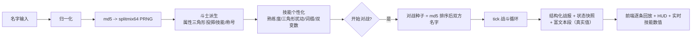
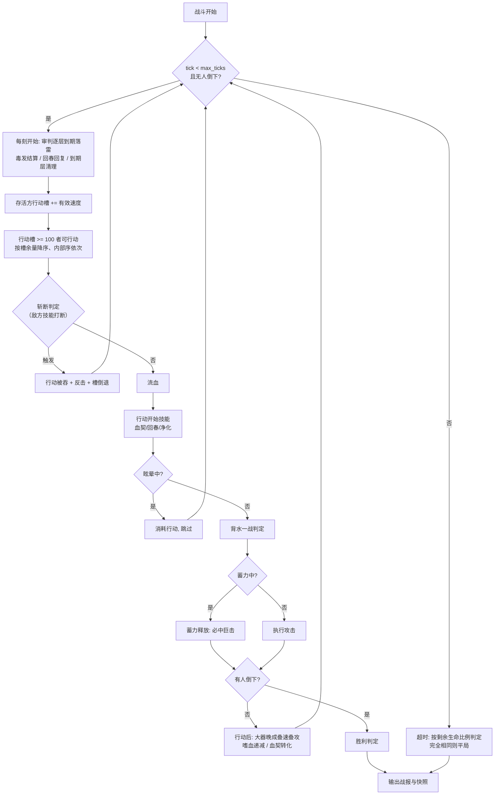

# 名字竞技场 · 完整规则与配置手册（GAME_SPEC）

> 本文档是游戏的**完整规则说明书**：流程图、全部细则与数值、每个 JSON 配置文件的
> 意义与调整指南。按 AGENTS.md 第 3.6 条，**每次更新涉及规则/数值/配置结构时必须
> 同步更新本文档**。当前版本：**v3.8.0**（与 `config/game/system.json` 的 `version` 一致）。

---

## 1. 总览

输入两个名字 -> 名字 MD5 确定斗士的一切（属性/技能/称号/熟练度/变数）-> 以 tick
推进的确定性回合对战。核心契约：**名字 + 配置不变 ⇒ 派生与对战结果永远不变**
（与进程、机器、请求次数、输入顺序无关）。

v0.10.0 的设计支柱：

- **配置单文件化**：数值与文案合并在 `config/game/*.json`（六个文件），每个条目的
  文字与其数值/加成绑定在同一条目内；多语言体系移除（固定中文）；
- **×100 整数量纲 + 真实值直显**：非百分比基础数值整体 ×100（命 20000 /
  攻防速 1500）；**全部计算结果取整**（多步浮点计算只在最终应用时取整一次）；
  显示不再换算，一律直显引擎真实值；
- **防御倒数百分比免伤**：`免伤率 = DEF / (DEF + defense_constant)`，
  取代旧版「攻击 − 防御」的直接扣减；
- **战报富文本**：每条战报附带 rich 段（阵营名红/蓝加粗、技能名各自配色加粗、
  伤害红 / 治疗绿），技能使用行后附个性化描述，逐条停顿回放。

v1.0.0 的增量：

- **量纲微调**：防御数值减半（750、[500,1000]）；**速度与行动条回退旧版
  小量纲**（速度 10、[6,14]；行动槽阈值 100）；相关技能参数同步换算；
- **熟练度高斯投掷**：熟练度由 `next_gaussian_range(0,100)` 高斯抽取
  （集中于 50，消耗随机数的方式与次数不变）；
- **普通攻击宣告**：每次攻击行动前输出 `attack_start` 战报行；
- **回放模式**：普通模式每 5 次角色行动插入一次较长停顿（均可配置）；
  新增**单回合递进模式**（手动每次推进一次角色行动）；
- **创意工坊**：`/workshop.html` 独立管理页，可视化编辑全部配置 JSON，
  草稿试运行（不落盘）与校验保存热重载。

v1.1.0 的增量：

- **三角形分布投掷**：全部数值类随机（属性/技能数量/熟练度/扰动倍率/
  共鸣倍率/伤害浮动）由高斯（Box-Muller，端点截断）改为**三角形分布**
  （两个均匀随机数取均值，密度在中点最高，天然落在区间内、端点无
  截断堆积）；
- **中毒改为每刻结算**：毒伤在每刻开始结算（原先在拥有者行动时），
  持续以刻计；淬毒之刃改为 38 点/刻 × 12 刻；
- **真实伤害视作攻击**（雷罚落雷）：无视防御与闪避，但**可被伤害减免
  降低**（锻痕/壁垒/反甲），并触发受击反应（以牙还牙记录/怨念/锻痕叠层）；
- **大器晚成附带加攻**：触发时速度 +1 且攻击 +10；
- **不屈意志衰减改为 ×0.5 乘算**（50% -> 25% -> 12.5% …）；
- **共鸣公式显示改版**：百分数字段括号内为纯数字（两位小数）、百分号
  移到括号外，如「伤害提升至 375.52%（355.61+❤️*0.01）%」；
- **用户手动调参**（保留）：命 [10000,30000]、速度 [5,15]、暴击基准 15/
  [5,30]、闪避上限 80、大小写敏感、种子分隔符 `-`、技能数 [1,3]、
  扰动区间 [0.5,1.5]、新增词缀「极限」等；
- 平衡重调：6000 场蒙特卡洛下技能持有者胜率 45.5%–56.1%。

v1.2.0 的增量：

- **对战实时共鸣数值错位修复**：live 文本占位符由裸 `\u0001` 改为
  `\u0001 + 槽位序号`（序号 = 变数在 `eff.links` 中的下标，与 `link_calc`
  下标一致）；前端**按序号**（而非占位符出现位置）取值替换。修复前当
  模板参数顺序与共鸣槽位顺序不一致（如壁垒「门槛/效果值」）时，两个
  共鸣字段的实时数值会交叉错位显示；
- **共鸣公式小值显示**：公式数值改为保留两位有效数字——低于 0.1 的值
  不再被两位小数吞成 `0.00`：百分字段括号内的纯数字转为百分数形式
  （如 `❤️*0.21%`），数值字段的百分数系数加深小数位（如 `*0.0042%`）；
- **创意工坊悬浮提示**：工坊每个选项（字段标签/表头/分区标题/技能卡
  各栏）附带「?」悬浮提示，中文说明该量的含义与相关量的关系。

v1.2.1 的增量：

- **速度与行动槽 ×100 量纲**：速度 10/[5,15] -> 1000/[500,1500]，
  `gauge_threshold` 100 -> 10000（节奏不变，约每 10 刻一动），速度/行动槽
  相关技能参数同步 ×100（斩断倒退 900、疾影前进 2800/4800、大器晚成叠速
  +100、称号速度加成 ±100），取整粒度大幅变细、对数值的影响显著减小；
- **战报角色名带称号**：战报中的角色名一律为「【称号】名字」
  （`_Combatant.name`），胜利宣告与结算横幅同样显示全名；
- **角色名头顶血条**：「命中」行不再以「（X 剩余 N）」文本呈现剩余生命，
  改由前端在每个角色名头顶渲染**无数字的简易血条**--蓝=当前生命、
  红=本次掉血、绿=本次回血、灰=空（数据 = 本条快照与上一条快照的生命差）；
- **称号结构固定为「前缀+主体」**：structures 仅保留 `prefix_core`
  （连接符空串直拼）；称号池大幅扩充（前缀 72 / 核心 62，v1.2.1 用户手动
  添加并补全描述与加成），候选词条库见 `docs/title_candidates.md`
  （500 前缀 + 500 主体，筛选后手动并入）。

v1.3.0 的增量：

- **头顶血条当前段改白色**：角色名头顶简易血条配色由「蓝=当前」改为
  「白=当前」（蓝色与蓝方阵营名易混淆），红=本次掉血、绿=本次回血、
  灰=空不变；
- **暴击加成按百分数显示（修复）**：`charge`/`armor_pen` 的 `crit` 字段
  统一为百分数分数口径（配置 25 -> 0.25、6 -> 0.06），技能描述与战报
  显示为「暴击率 +6.00%」；共鸣上下限同口径（`("armor_pen","crit")`
  原 num/200 的上限会错误截断到 5 个百分点，一并修复）；
- **真战力系统**：`/power.html` 独立测量页 + `POST /api/power`，与
  `power_check.enemies`（默认 10000）个固定编号敌人（名字 "1".."N"）
  各打一场极速对战，**胜场数即真战力**，与现行面板战力并行显示；
  正常对战不触发；敌人斗士按配置快照缓存。

v2.0.0 的增量（**breaking：同名对战结果改变**）：

- **技能引擎四层解耦**：技能逻辑从引擎硬编码改为**节点图数据**（触发钩子 →
  条件 → 效果原语），注册表见 `namefight/effects.py`；条件失败即跳过其下游
  子树；新技能 = 纯配置操作，不再需要改引擎代码；
- **状态系统数据化**：16 种状态按行为 kind 由通用容器承载，定义（kind /
  参数规格 / 事件模板 / 文案）移入 `battle.json` 的 `statuses` 节（原 `buffs`
  并入）；施加与结算按 kind 分发，**新建同 kind 状态无需改引擎**；
- **引擎自描述 API**：新增 `GET /api/schema`（钩子 / 条件 / op 参数规格 /
  状态 kind / 状态定义），编辑器表单完全由 schema 驱动；
- **可视化编辑器**：`/editor.html` 节点画布（SVG 连线 + 类型化参数表单）
  完全取代创意工坊（workshop 三件套删除）；
- **怪癖修复**（详见 `docs/updates/2026-09-01-v2.0.0.md`）：渐入佳境读个性化
  触发率、孤注一掷独立胜负参数、破甲按刻到期、报复可驱散、血契转化为显式
  节点、护盾/反甲上限入配置（`guard_reduction_cap` / `reflect_split_cap`）。

v3.0.0 的增量（**breaking：同名对战结果改变**，最小原子化）：

- **最小原子规则集**：23 个效果原语压缩为 **11 个原子 + 1 个结构**——攻击方式
  （strike / hit_mod / taken_mod / grant_immune）、基础变动（stat_mod 属性 /
  hp_mod 体力 / gauge_mod 行动槽）、施加与驱散（apply_status / cleanse）、
  记录与信号（record / skip_action）、结构（**loop 循环**：第 1 轮必定执行，
  第 i 轮按 decay^(i-1) 续链，至多 max 轮——雷罚连击）；
- **判断 / 分支 / 循环入图**：条件节点出边分 **pass / fail 两条**（孤注一掷的
  胜负分支、疾影的暴击判定分支）；新条件 `last_crit`（本次暴击）、
  `has_status` / `no_status`；`once_per_battle` 修复为下游真执行才占次数；
- **状态定义 v3**：策略字段（stack 叠层 / expire 到期 / interval 间隔 /
  reset_on_miss 落空清零 / **lethal 致命拦截**——不屈）+ params 数值参数 +
  **mods 被动修饰表**（8 种 kind：增伤 / 减伤 / 攻防速乘区与加值 / 破甲 / 吸血）+
  **effects 效果图**（与技能图同格式，5 个状态钩子：施加时 / 每 interval 刻 /
  拥有者行动时 / 替换拥有者行动 / 命中后）——毒发、流血、回春、眩晕、蓄力
  释放、血契吸血全部是状态图上的原子组合，可分状态编辑；效果图中以
  `"$参数名"` 引用施加参数（含个性化 / 共鸣结果）。



---

## 2. 随机体系

### 2.1 名字归一化

| 规则 | 当前值（`game/system.json` -> `name`） |
| --- | --- |
| 去除首尾空白 `trim` | `true` |
| 大小写折叠 `case_sensitive` | `true`（v1.1.0 用户调参：`Alice` ≢ `alice`） |
| 最小/最大长度 | 1 / 32 |

归一化后为空 -> 400 `empty_name`；超长 -> 400 `name_too_long`。内部空格保留。

### 2.2 数值精度与取整（v0.10.0）

- **后台不取整、保留全浮点**：个性化参数、共鸣系数、伤害公式、吸血、破甲等
  中间量全程浮点运算（离散计数如持续刻数仍为整数）；
- **计算结果取整**：多步浮点计算只在**最终应用时取整一次**（`battle._r`，
  Python round 银行家舍入，双方同规则）--伤害/治疗/吸血/毒/流血/回春/破甲/
  叠速/血契转化/行动槽推进等在作用于 HP/属性/行动槽的瞬间取整；
  非百分比属性投掷即取整（整数量纲），血量全程保持整数；
- **展示层：百分数保留 2 位小数，其余数值保留整数**--
  `format_pct`（"13.02%"）/ `format_num`（"8"）；战报、HUD 与汇总同一规则
  （前端 `fmtPct` = `toFixed(2)+"%"`、`fmtInt` = `Math.round`）；
  快照中的数值四舍五入到 2 位（仅数据精度，不影响内部运算）。

### 2.3 抽样规则

- **离散选择**（选哪个技能/称号结构/字段/词缀/共鸣模式与变量）：加权均匀抽取；
- **数值抽样**（属性投掷、技能数量、熟练度、个性化扰动倍率、共鸣倍率、伤害浮动）：
  **三角形分布** `DetRng.next_triangular(lo, hi)`（v1.1.0）--两个均匀随机数
  取均值（每次消耗两个均匀数），密度在区间中点最高、向两端线性递减，
  **天然落在区间内，端点不会发生截断堆积**；离散数值（技能数量、熟练度
  0–100）用 `next_triangular_range`（±0.5 扩展后取整）。
  （v1.0.0 及之前为 Box-Muller 高斯 + 端点截断，端点各有 ~2.4% 的堆积概率，
  正是旧版部分名字出现大量极限值的原因。）

### 2.4 派生主 PRNG 消耗顺序（v0.9.1 起固定，改变即 breaking）

种子：`md5(归一化名字)` -> splitmix64。

1. 属性（配置顺序，每维一次**三角形投掷** `[min, max]`；非百分比属性取整）
2. 技能数量 k（**三角形**，[1, 3]，2 最常见；v1.1.0 用户调参下限 2 -> 1）
3. 技能抽取（不放回加权，保持顺序）
4. 称号结构（加权）-> 称号字段（按结构顺序加权；core2 排除已用核心）
5. 称号字段加成叠加到投掷值（纯查表，不消耗随机数；下限 1）
6. 战力 = Σ(属性 × 权重)

**元素系统已删除**（v0.9.1）；**稀有度系统已删除**（v0.5.0）；
属性随机于 v0.9.1 恢复（v1.1.0 起为三角形分布投掷）。

---

## 3. 属性（`game/attributes.json`）-- 真实值直显（v0.10.0）+ 量纲调整（v1.0.0）+ 用户调参（v1.1.0）

| 属性 | 基准 base | 投掷区间 | 战力权重 | emoji |
| --- | --- | --- | --- | --- |
| hp 生命 | 20000 | 10000–30000 | 1 | ❤️ |
| atk 攻击 | 1500 | 1000–2000 | 4 | ⚔️ |
| def 防御 | 750 | 500–1000 | 3 | 🛡️ |
| spd 速度 | 1000 | 500–1500 | 0.02 | 👟 |
| crit 暴击 | 15% | 5–30 | 2 | 🎯 |
| dodge 闪避 | 10% | 5–15 | 2 | 🌀 |

- **属性 = 三角形投掷值 + 称号加成**（下限 1）：投掷在 `[min, max]` 内三角形
  分布（密度在中点最高、向两端线性递减，端点无截断堆积）；非百分比属性
  **取整**，crit/dodge 为百分数（浮点）；称号加成可把面板推过区间；
- **显示 = 引擎真实值**：v0.9.1 的白板 100 换算（display_ref）已删除，
  卡牌 / HUD / 快照 / 战报数值 / 共鸣公式一律直显；
- 属性条按投掷区间线性映射到 **8%–92%**（永不空条/满条）；
- 量纲（v1.0.0 / v1.2.1）：命/攻保持 ×100 整数量纲；**防御减半**；**速度与
  行动槽同为 ×100 量纲**（v1.2.1，速度 ~1000、阈值 10000，取整影响更小）。
  量纲相关数值示例：破甲每层 340（防 750 量纲）、行动槽推进 2800/4800
  （阈值 10000 量纲）、斩断倒退 900、大器晚成每动 +100 速/+10 攻
  （速 1000/攻 1500 量纲）、毒伤 38/刻 / 回春 550 等以命 20000 量纲的绝对值。

---

## 4. 技能体系

### 4.1 技能池（`game/skills.json` -> `skills`）

每名斗士不放回抽取 **1–3** 个（三角形，2 最常见；v1.1.0 用户调参下限 2 -> 1）。
共 **25** 个技能。**v3.0.0 起技能逻辑为节点图**（`effect = {nodes, edges}`），
节点四类，构成「判断 / 分支 / 循环」完备的规则集：

- **trigger 触发**（13 种钩子）：battle_start / action_interrupt / action_start /
  before_attack / on_attack / on_defend / on_hit_landed / on_hit_taken /
  after_action / **on_status_gain（获得状态时——等待状态的事件驱动形态）** /
  **on_status_lose（失去状态时——施加点即时 + 到期每刻检测）** /
  **on_attack_miss（攻击落空时——落空清零的原生实现位）** /
  **on_lethal（生命将降至 0 以下时——钩子内可救援，不屈的原生实现位）**；
- **condition 条件**（9 种，出边带 gate: pass/fail 构成**分支**）：chance /
  **compare（比较值与值**：左右各取 14 种值源——自身/敌方 × 生命比例、攻、
  防、速、暴击、闪避、行动槽比例，右值可 const 固定值；运算 < ≤ > ≥）/
  stacks_cmp（层数比较）/ has_status / no_status /
  has_marker（可 op+count 层数比较）/ no_marker /
  once_per_battle / last_crit；
- **op 原子**（14 个最小原子）：strike（攻击：目标/倍率/真伤/穿透/暴击加成/
  必中/追加·替换·附加/基准/lifesteal 吸血）、hit_mod（修饰本次攻击）、
  taken_mod（减免所受）、grant_immune（完全免疫）、stat_mod（属性永久 ±）、
  hp_mod（体力治疗/流失，基准含 curhp 当前生命）、**hp_swap（v3.8.0：
  交换双方当前生命值，各自不超过自身上限——无中间态的精确互换，不可由
  hp_mod 组合表达）**、gauge_mod（行动槽）、
  apply_status（施加状态，唯一状态入口）、cleanse（驱散）、
  record（记录所受伤害/吸血量）、skip_action（吞行动）、
  marker（标记：置位/清除/翻转/叠层/减层 + 可选存在刻数）、
  status_ctl（状态操控：延长/缩短/叠层/清除）；
- **struct 结构**（loop **循环**：mode=chain 第 1 轮必定执行、第 i 轮按
  decay^(i-1) 续链；mode=count 固定 max 轮不掷骰）；
- **变量表与表达式**（v3.2.0）：全部数值参数可写表达式（数字、$变量、
  + - * / ( )、min/max/abs/floor）；变量 = 自身/敌方（生命、攻防速、暴击、
  闪避、行动槽、累计伤害、标记层数 `$self.mark:<键>`、状态层数 / 累计 /
  记录）+ 上下文（本次伤害 / 被减免量 / 循环轮次 / 当前刻）+ 状态图施加
  参数（$value 等）；解析器为手写递归下降（无 eval），配置加载时做语法
  校验；**共鸣槽位在派生期直接生成为表达式**（基数×(1+率×变量式/基准)），
  运行期与手写表达式同一条求值路径，links 仅作显示元数据（公式 / live
  占位 / link_calc 协议不变）。

执行顺序 = 技能派生顺序 × 触发节点数组顺序 × 边数组顺序（pass 组先于
fail 组）× loop 轮次（改变即 breaking）。
**各技能基础触发率按强度互不相同**（强效低频：斩断 8.5% … 弱效高频：
乘胜追击 80%），任何触发率永不超过 100%（个性化后截断 [2%, 95%]）。
v1.1.0 在三角形分布 + 用户调参的新环境下七轮重调
（6000 场蒙特卡洛，持有者胜率 45.5%–56.1%）。

| 技能 | 触发 | 基础效果（引擎真实值） | 熟练度区间 |
| --- | --- | --- | --- |
| 重击 heavy_strike | on_attack | 14% 概率蓄力（占一次行动）：下次行动必定命中、暴击+25%、伤害 ×2.2 | ×0.55–1.65 |
| 斩杀 execution | on_attack | 33% 概率，敌方 HP≤33% 时伤害 ×2.45 | ×0.7–1.5 |
| 嗜血 bloodthirst | on_attack | 25% 概率获得 2 次行动内 28% 吸血 | ×0.75–1.35 |
| 淬毒之刃 venom | on_attack | 30% 概率中毒：每刻 38 点，持续 12 刻（v1.1.0 每刻结算） | ×0.8–1.3 |
| 眩晕重锤 stun_blow | on_attack | 12.5% 概率破防重击：该击无视 35% 防御，命中眩晕 4 刻 | ×0.6–1.55 |
| 雷罚 thunder | on_attack | 78% 概率替换攻击：连续真实伤害（每道攻击 27%，后续每道概率 ×0.93 衰减，至多 9 道；v1.1.0 起可被伤害减免降低并触发受击反应） | ×0.85–1.15 |
| 斩断 sever | on_defense | 敌方即将行动时 8.5% 概率打断其回合并反击 ×0.45，其行动槽倒退 900 | ×0.65–1.5 |
| 疾影突袭 shadow_step | on_attack | 命中后 62% 概率行动槽 +2800（暴击 +4800；阈值 10000 量纲） | ×0.7–1.45 |
| 千锤百炼 iron_hide | on_defense | 受击时 65% 概率叠锻痕：每层减伤 7%，持续 20 刻，无限叠 | ×0.8–1.25 |
| 荆棘反甲 thorns | on_defense | 受伤时 23% 概率免伤 18% 并以 ×1.25 反弹该部分 | ×0.7–1.4 |
| 坚守壁垒 bulwark | on_defense | HP≥70% 时受伤 −8%，且 3% 概率完全免疫 | 免疫 ×0.6–1.6 |
| 以牙还牙 retribution | on_defense | 受击时 29% 概率记录伤害（至多 6 条）：下次命中以 ×0.38 追加打出总和 | ×0.7–1.45 |
| 不屈意志 iron_will | passive | 致命伤 52% 概率回复 28% 生命；每次触发后概率 ×0.5 乘算衰减 | ×0.5–1.5 |
| 回春术 spring_heal | on_turn_start | 15% 概率回复 550 点 + 回春印记（每 10 刻回 150 点，持续 30 刻） | ×0.75–1.4 |
| 净化 purify | on_turn_start | 13% 概率驱散双方所有标记与增益减益（每种回 190 点）+ 回 215 点 | ×0.7–1.5 |
| 背水一战 last_stand | passive | HP<30% 时攻击 +20%、速度 +20%（一次触发，持续到结束） | 效果 ×0.8–1.3 |
| 乘胜追击 momentum | on_attack | 命中时 80% 概率 +1 层（每层 +6.5%，至多 5 层），落空清零 | ×0.85–1.2 |
| 燃血轰击 overload | on_attack | 35% 概率消耗 5% 最大生命，本次伤害 ×2.15 | ×0.65–1.55 |
| 破甲连打 rupture | on_attack | 36% 概率击碎护甲：防御 −340（可叠 3 层），持续 16 刻 | ×0.75–1.35 |
| 撕裂 lacerate | on_attack | 32% 概率流血：每动损失攻击者攻击 20% 的生命，持续 12 刻 | ×0.75–1.35 |
| 孤注一掷 all_in | on_attack | 39% 概率伤害 ×2.2，否则 ×0.5 | ×0.7–1.5 |
| 大器晚成 late_bloom | passive | 每次行动后 16% 概率速度 +100、攻击 +10（v1.1.0 加攻），无上限叠加 | ×0.85–1.15 |
| 洞悉 true_sight | on_attack | 42% 概率该击无视全部防御且暴击 +6% | ×0.7–1.45 |
| 血契 blood_pact | on_turn_start | 40% 概率献祭 6% 最大生命：该次攻击 68% 吸血，行动后按吸血量的 11% 永久加攻击 | ×0.7–1.45 |
| 怨念深重 grudge | on_defense | 被命中时 60% 概率 +1 层怨念（持续 20 刻）：每层伤害 +7%，无上限 | ×0.75–1.4 |
| 洗礼 baptism | on_attack | 22% 概率自身与敌方各回复 600 点，命中则给敌方刻 1 层审判标记（**每层 1300 点，独立倒数 12 刻、独立携带施加时的数值**，到期各罚一次、可致死；可驱散） | 效果 ×0.55–1.65 |
| 命运天平 fate_scale | on_hit_taken | 被命中后：敌方生命比例更高时 9.5% 概率**交换双方当前生命**（各自不超过上限），否则 58% 概率自扣 350 点（保底 1 点） | 触发率 ×0.6–1.5 |

调参记录（v0.10.0，防御倒数免伤 + 生命翻倍使对局拉长至平均 ~100 刻）：
续航/DoT 首测大热（净化 73.1%、淬毒之刃 68.7%、千锤百炼 61.0%、回春 61.0%），
自伤型大冷（燃血 27.9%、血契 38.7%、重击 40.0%）；四轮下调续航、加强自伤与
蓄力后全部回到 46.5%–54.6%。大器晚成因对局变长而降频提额（84%/+34 ->
28%/+97，即旧量纲 0.34 ×100）。

调参记录（v1.0.0，防御减半 + 速度/行动条回退旧量纲后三轮重调，6000 场蒙特卡洛）：
防御减半使爆发型偏强（斩杀 56.9%、血契 56.9%、燃血 56.5%、壁垒 56.3%）、
破甲偏冷（42.9%）；下调斩杀/燃血/血契/壁垒、上调破甲后全部回到
45.9%–54.6%（平均对局 ~127 刻）。

调参记录（v1.1.0，三角形分布 + 用户调参 + 中毒每刻/真伤吃减免后七轮重调，
6000 场蒙特卡洛）：三角形分布使属性更集中、对局样本整体洗牌--首测壁垒 65.3%、
重击 62.9%、净化 58.8% 大热，不屈 40.5% 大冷；七轮下调壁垒/重击/净化/
大器晚成/眩晕重锤/以牙还牙/荆棘，上调不屈（回复 20%->28%、概率 44%->52%）/
洞悉/孤注一掷后收敛至 45.5%–56.1%（平均对局 ~129 刻）。

### 4.2 个性化（`md5(名字:技能id)` 独立种子）

消耗顺序固定（v0.9.0，改变即 breaking）：**熟练度 -> value -> damage ->
前缀(是否->抽取) -> 后缀(是否->抽取) -> 变数槽一(是否->模式->变量->倍率) ->
变数槽二(同前)**。

- **熟练度 `mastery`**：**三角形分布投掷** 0–100（v1.1.0 起
  `next_triangular_range`，集中于 50；随机消耗方式不变），按技能各自的
  `mastery: [lo, hi]` 区间换算为倍率 `mult = lo + (hi−lo)×熟练度/100`，
  作用于 `mastery_on` 字段（默认 `chance`；v2.0.0 起可为参数名数组，如背水一战
  `["value","spd"]` 同时缩放攻击与速度，坚守壁垒 `immune`）。
  概率截断 [2%, 95%]、免疫截断 [1%, 50%]；
- **方差扰动 `md5_variance`**（**三角形分布**）：`value: [0.5, 1.5]`
  （v1.1.0 用户调参）缩放效果主参数（`damage` 字段同理）；
- **名称词缀 `name_modifiers`**（名称与修正值同条目保存）：前缀 50% /
  后缀 40%；词缀对技能**已有参数**做小幅加法修正，且**修正值按名字个性化
  三角形分布缩放**（`mod_variance` = [0.5, 1.5]，v1.1.0 用户调参）：

| 词缀 | 修正 | | 词缀 | 修正 |
| --- | --- | --- | --- | --- |
| 疾风(前) | 触发率 +3% | | 破军(后) | 效果值 +6% |
| 猛烈(前) | 效果值 +8% | | 突袭(后) | 触发率 +4% |
| 蚀骨(前) | 毒伤 +100 | | 入骨(后) | 毒伤 +100 |
| 缠绵(前) | 持续 +2 刻 | | 不息(后) | 持续 +2 刻 |
| 浩大(前) | 效果值 +5%、触发率 +2% | | 汹涌(后) | 效果值 +12%、触发率 -3% |
| 极限(前)（v1.1.0 用户新增） | 效果值 +10%、触发率 -2% | | | |

### 4.3 变数共鸣（v0.9.0 双槽位模型）

- v2.0.0 起可共鸣资格由**效果原语参数规格的 `link` 标记**声明（原
  `variable_link.targets` 按「效果类型」声明的表已删除）；`variable_link.max_slots`
  （1–4，当前 2）限定每技能共鸣槽位上限；
- 每个槽位独立以 `chance = 25%` 的概率实际成为变数（技能级出现率 ≈ 44%，
  双变数率 ≈ 6%）；
- **模式**（`mode_weights`）：己方单值 own 10 / 敌方单值 enemy 3 /
  差值 difference 2 / 并值 sum 1--单值占绝对多数，己方优先；
- 变量池与倍率（**三角形分布**）不变：atk 3 / def 2 / spd 3 / hp 2 / crit 1 / dodge 1，
  归一化倍率 0.25–0.65；差值/并值与**同名属性**运算（`diff_against` 缺省为
  变量自身，攻↔攻、速↔速等，【己方-对方】⚔️ 即双方攻击之差）。
- **共鸣绑定覆盖表（v3.5.0，编辑器可编辑）**：技能可声明 `resonance`
  列表（`{node?, param, variable, mode, rate}`），声明的参数**固定绑定**
  ——不掷概率、不抽变量、倍率不再随机；`node` 精确锚定节点，缺省匹配
  图内首个该名可共鸣参数；未声明的参数照旧随机，覆盖与随机共享
  `max_slots` 上限。编辑器技能面板的「共鸣绑定（覆盖随机抽取）」区块
  按节点逐参数提供下拉（随机 / 六属性）与模式、倍率编辑；
- **触发率可共鸣（v3.7.0，恢复 v1「触发门槛」共鸣）**：chance 条件参数
  link=True（钳制 [0.02, 0.95]）——触发率可随属性浮动，描述显示
  「有 79.03%（52.50 + 👟*2.36%）% 概率」式公式；编辑器共鸣绑定对
  未填数值的可共鸣参数也开放（绑定时自动写入安全默认值），新技能
  建好节点即可配共鸣；
- **禁用共鸣（v3.8.0）**：覆盖表 `variable` 留空 = 该参数**永不共鸣**
  （不掷概率、不占槽位）；编辑器下拉提供「不共鸣（禁用）」选项——
  想让某属性 / 参数绝缘共鸣时明确锁定，而非听凭随机。

**共鸣计算**（触发时刻按当前值动态计算，不改变技能逻辑，只修正技能自身参数）：

```
coeff = rate × ( 变量式 ÷ 变量基础值 )
  own:        己方[变量]
  enemy:      敌方[变量]
  difference: 己方[变量] − 敌方[参照]        // 可为负
  sum:        己方[变量] + 敌方[参照]
最终参数 = 基础参数 × (1 + coeff)，按字段规格截断（RESONANCE_SPECS）
```

「当前值」：hp = 当前生命，atk = 含背水一战/血契转化，def = 破甲后有效防御，
spd = 含背水一战速度加成，crit/dodge = 面板。v0.10.0 起全部为引擎真实值。

### 4.4 技能描述（v0.10.0 格式）

- **描述 = 一句自然语言**（v2.0.0 组合式生成）：沿技能图每条「触发→条件→效果」
  链拼接 `stats` 词表——钩子引导语 `hook_*` + 条件从句 `cond_*` + 原语句
  `op_<原语>`（状态类原语引用 `st_<状态id>` 名称）+ 标签 `lbl_*`，
  链间以「；」连接；模板占位符与参数同名（`{chance}` `{value}` `{ticks}` 等）；
  **v3.6.0 攻击链细分**：on_attack 子树含 `mode=replace` 的 strike 时引导语
  用 `hook_on_attack_replace`（「替代攻击时」——雷罚；子树为修饰 / 施加类则
  仍为「攻击时」，攻击照常进行）；
- **共鸣公式括号紧跟对应数值**（每技能至多 2 个）：
  「数值（基数 + 变量式*合并系数）」，基数与合并系数均为引擎真实值
  （合并系数 = 基数 × 倍率 ÷ 变量基准值）。变量式用属性 **emoji**：own 省略
  范围词（`⚔️`）、enemy 前缀「对方」（`对方⚔️`）、差值/并值用【】包裹
  （`【己方-对方】⚔️` / `【己方+对方】⚔️`）；连接符为 `*`；
  **v1.1.0 显示改版**：百分数字段括号内为**纯数字**（基数与合并系数均保留
  两位小数、无百分号），百分号移到括号外--如
  「伤害提升至 375.52%（355.61+❤️*0.01）%」；绝对数值字段（毒伤/破甲量/
  行动槽等）基数仍为整数、合并系数仍以百分数表示（其系数过小，纯两位
  小数会失真）；**v1.2.0 小值保护**：数值保留两位有效数字--低于 0.1 的
  值不再显示为 0.00：百分字段括号内的纯数字改百分数形式（×100 加 %，
  如 `❤️*0.21%`），数值字段的系数加深小数位（如 `*0.0042%`）；
- **尾句依赖描述**用属性全名：「己方攻击越高，效果值越高。」等；
- **熟练度行**：技能名行右侧显示**最终触发率**「熟练度 63：触发率 36.52%」
  （壁垒类为「免疫触发率 …」，条件型为「效果 ×1.21」）；
- **对战实时技能数据**：主句数值随双方当前快照逐刻变化（后端提供 `live_text`
  （每个共鸣数值位为 `\u0001 + 槽位序号` 占位符，至多 2 个；序号 = 变数在
  效果中的槽位下标，与 `link_calc` 数组下标一致）与
  `link_calc = [{field, fmt, base, coeff, mode, variable, against, clamp}, ...]`
  （全部为引擎真实值）；前端按 `最终值 = base + 变量式 × coeff`（含上下限截断）
  **按占位符携带的序号**重算（模板参数顺序与槽位顺序可能不一致，
  按位置填充会错位，v1.2.0 修复），与引擎 `resonance_coeff + apply_resonance`
  完全一致，有测试保障）；
- **简易显示模式**：前端开关（记忆 localStorage），隐藏数值后的公式括号；
- 技能名组装：`[前缀·]技能名[·后缀][·共鸣标记…]`（标记：锋/坚/疾/命/锐/影，
  双变数时依序追加两个标记）。

---

## 5. 称号系统（`game/titles.json`，名称/描述/加成同条目）

| 结构 | 权重 | 字段 | 连接 | 示例 |
| --- | --- | --- | --- | --- |
| prefix_core | 1（唯一） | 前缀+主体 | （空串直拼） | 暗夜剑圣、可能是王者 |

**v1.2.1 起称号结构固定为「前缀+主体」**（structures 仅 `prefix_core`，
系统结构未变、随时可加回其他结构）。字段池：前缀 ×72、主体 ×62、
后缀 ×8（后缀池暂不被引用，保留备用；见 `game/titles.json`，
每条目同时含 `name`/`desc`/`bonus`）。候选扩充库：
`docs/title_candidates.md`（500 前缀 + 500 主体候选，筛选后手动并入）。

**称号加成**（与属性同量纲：攻 ±100~250、防 ±50~250、**速 ±100~200**、
命 ±200~800、暴/闪 ±1~3；**一个词条最多三种属性、可负**）：

- 前缀：单项或组合（如 苍穹 速+100、大块头 命+800/攻+100/速−150、
  禁忌 攻+200/命−300/暴+2）
- 主体：单项或组合（如 剑圣 暴+1、王者 命+500/攻+100、
  石像鬼 防+250/命+300/速−200）
- 后缀（暂不引用）：无双 攻+100暴+1 / 觉醒 暴+1闪+1 / 再临 命+600 /
  传说 攻+200 / 亲卫 防+100 / 见习 暴+1 / **候补 攻−100** /
  **退役 速−100 防+50**（负加成为刻意设计）

卡牌聚合加成行直显真实值（如「攻击 +100 · 暴击 +1%」）。
描述 = 字段描述片段以「，」连接 +「。」；卡牌另展示聚合加成行。

---

## 6. 战斗规则（tick 模型）

**种子**：`md5(排序后的双方规范化名字 以 - 连接)`（v1.1.0 用户调参：
`seed_separator` 由 `\u001f` 改为 `-`）；内部序 = 速度降序、
名字升序（与输入顺序无关；镜像对战允许）。



### 攻击结算顺序（常规攻击）

1. on_attack 技能逐个判定（按技能顺序）：应用共鸣（动态当前值）-> 掷触发 ->
   结算效果；**重击蓄力**触发即占用本次行动（返回）；**雷罚**触发即替换本次攻击；
2. 怨念层加成（当前有效层数 × 每层加成计入倍率，无上限）；
3. 闪避判定（`rand < 敌方闪避%` -> 落空，乘胜追击清零）；
4. 暴击判定（含洞悉/蓄力的临时暴击加成）-> **三角形**伤害浮动 -> 伤害公式；
5. on_defense 结算（防守方技能顺序）：锻痕存量减伤 -> 坚守壁垒（免疫掷骰 /
   高血量减伤）-> 荆棘反甲（免伤 + 反弹，反弹可致死）-> 锻痕叠层掷骰；
6. 以牙还牙释放（记录总和 × 倍率追加为固定伤害，独立取整）-> 结算伤害
   （**不屈意志**触发判定在致命伤时进行）；
7. 命中反应（乘胜叠层掷骰 -> 怨念叠层掷骰 -> 以牙还牙记录掷骰，均按技能顺序）；
8. 吸血（嗜血增益 + 血契献祭共享）-> 上破甲/毒/流血/眩晕 -> 疾影突袭行动槽推进。

**雷罚链**：替换攻击后逐道结算--第 1 道必定劈落，第 i 道的概率为
`chance × decay^(i−1)`（首道概率即触发率，逐道独立掷骰），至多 `max_hits` 道；
每道为真实伤害（`有效ATK × atk_factor × value × 三角形浮动`，无视防御与闪避、
不可暴击），**v1.1.0 起每道视作一次攻击**：走 on_defense 结算
（锻痕/壁垒/反甲等伤害减免可生效、可触发免疫），命中反应照常（乘胜叠层/
怨念积攒/以牙还牙记录）；被反甲反弹致死时雷罚链终止。

**斩断反击**：敌方行动开始时掷骰；触发则该次行动被吞、行动槽倒退 `delay`，
反击为一次小倍率普通打击（可闪避/暴击/吃防御与防守技能，不吃攻击技能链）。

**伤害公式**（v0.10.0：防御为倒数百分比免伤；全程浮点，最终应用时取整一次）：

```
有效防御 = max(0, 敌方DEF − 破甲每层值 × 层数)          // 破甲到期后清零
raw    = 有效ATK × atk_factor(1.0) × 三角形浮动([0.85,1.15]) × 暴击倍率(1.8) × 技能倍率
免伤率  = 有效防御 / (有效防御 + defense_constant(2500)) × (1 − 穿透率)
dmg    = 取整一次( max( 100, raw × (1 − 免伤率) ) )
减伤后  = max( 100, dmg × (1 − 锻痕/壁垒减伤率) )        // 壁垒免疫则直接为 0
```

### 状态类规则（v0.9.0 起以「刻」为期；v3.0.0 状态定义 = 策略字段 + params + mods + 效果图）

- **状态容器**：`_Combatant.st`（状态 id → 运行时数据）+ `markers`（一次性 /
  不屈已触发标记）；状态定义于 `battle.json` 的 `statuses` 节，每个自带：
  - 策略字段：`stack`（refresh 刷新 / layers 逐层独立到期 / count 计数至上限）、
    `expire`（ticks 按刻 / actions 按行动数 / none 无期限）、`interval`
    （on_status_tick 间隔，可 `$参数`）——v3.3.0 起不再有任何行为性特例字段
    （落空清零 = on_attack_miss 钩子链；不屈 = on_lethal 钩子 +
    pow 表达式概率衰减 + marker 计数，均为技能图原子组合）；
  - `params`：数值参数规格（施加时以 apply_status 参数覆盖默认值，
    个性化 / 共鸣即作用于此；持续参数统一命名 `turns`）；
  - `mods`：被动修饰表（10 种 kind：dmg_out_pct 增伤 / dmg_in_cut_pct 减伤
    （总量钳 guard_reduction_cap）/ atk_pct · spd_pct 乘区 / atk_flat · spd_flat
    加值 / def_break 破甲 / lifesteal_pct 吸血（可 record 吸血量）/
    shield 护盾池——受击先按施加顺序消耗护盾余量（示例状态 barrier）），
    引擎在攻防聚合点按施加顺序聚合；
  - `effects`：**状态效果图**（与技能图同格式，钩子为 6 个状态钩子：
    on_status_apply / on_status_tick / on_owner_action / on_owner_action_consume
    （替换拥有者行动——蓄力释放）/ on_owner_attack_hit /
    **on_status_expire（v3.4.0：layers 模式逐层到期，每层触发一次，在
    on_status_lose 之前——审判标记）**），图中以 `"$参数名"`
    引用施加参数——毒发、流血、回春、眩晕、蓄力释放、血契吸血、审判落雷
    全部是图上的原子组合；**新建状态（再添一种毒、新叠层）无需改引擎**；
- **刻期限状态**：中毒 / 流血 / 眩晕 / 破甲 / 回春印记 / 怨念层 / 锻痕层--
  持续 `turns` 刻（或行动数），到期自动失效（**v2.0.0 修复：破甲此前实际
  永不过期**）；毒伤在每刻开始结算（interval 1），流血在拥有者行动时结算
  （on_owner_action 钩子）；眩晕同走 on_owner_action（skip_action 原子）；
- **审判标记（v3.4.0）**：layers 模式的「时间炸弹」型状态——每层独立倒数，
  到期时刻（施加刻 + turns）在每刻开始**逐层触发** on_status_expire 效果图
  （洗礼：每层 1300 点体力流失，can_kill 可致死，判定先于 on_status_lose）；
  **v3.5.0 起每层独立携带施加参数快照**（`layers = [到期刻, 参数]`）——
  共鸣使每次施加的数值都可能不同，不同施加的层互不覆盖、各按自己施加时
  结算的数值落雷；被驱散的层不触发（走 on_status_lose 路径）；
- 眩晕持续期间拥有者的行动被跳过（短持续可能完全错过行动窗口，属刻意设计）；
- 净化驱散**双方**所有标记与增益减益（毒/血/晕/破甲/蓄力/乘胜层/怨念层/锻痕层/
  记录/嗜血/回春/审判层——驱散即免除其到期伤害），**不可驱散**：背水一战、
  大器晚成层数（永久成长）、不屈意志、血契已转化攻击；每驱散一种为净化者回复 `per` 点
  （**v2.0.0 修复：以牙还牙记录恢复可驱散**，各状态可驱散性由 kind 的
  `dispellable` 声明）；
- 不屈意志：每次致命伤独立掷骰（当前概率），成功则**回复** `value × 最大生命`
  点生命（不溢出），概率**乘算衰减 ×decay（0.5，v1.1.0）**--52% -> 26% -> 13% …，
  **逐次减半、永不归零**（`0.52 × 0.5^N` 浮点恒正；v3.3.0 起为 on_lethal
  钩子 + 表达式 `pow(0.5, $self.mark:不屈)` + marker 计数的图实现），
  可多次触发；
- **大器晚成**：每次行动后掷骰，触发则速度 +`value` 且**攻击 +`atk`
  （v1.1.0 新增）**，无上限持续叠加；渐入佳境标记显示累计速度与攻击增量；
- 蓄力属于标记（可被净化驱散）；以牙还牙记录在**命中落地**时释放清空；
- **血契**：献祭后本次攻击的吸血在行动结束后按 `convert` 比例永久转化为攻击
  （每次取整、累计到 `pact_total_gain`）；血契标记只显示**累计转化攻击**。

### 战斗常数（`game/battle.json`）

| 常数 | 值 |
| --- | --- |
| gauge_threshold | 10000（行动槽阈值，每刻 += 有效速度；速度 ~1000，v1.2.1 起 ×100 量纲） |
| atk_factor | 1.0 |
| defense_constant | 2500（倒数免伤常数 K：免伤率 = DEF/(DEF+K)） |
| max_ticks | 600 |
| crit_multiplier | 1.8 |
| variance | [0.85, 1.15]（三角形浮动区间，天然有界） |
| min_damage | 100 |
| crit_cap / dodge_cap | 100 / 80（闪避上限 v1.1.0 用户调参 60 -> 80） |
| guard_reduction_cap | 0.75（锻痕叠层总减伤上限，v2.0.0 提为配置） |
| reflect_split_cap | 0.9（反甲减免/分流比例上限，v2.0.0 提为配置；v3.3.1 起引擎实际生效） |
| seed_separator | `-`（v1.1.0 用户调参，原 `\u001f`） |
| playback.message_delay_ms | 320（前端每条战报的停顿时长，可配置） |
| playback.action_pause_every | 5（普通模式每 N 次角色行动插入一次较长停顿） |
| playback.action_pause_ms | 1600（该较长停顿时长，可配置） |
| power_check.enemies | 10000（真战力测量的固定编号敌人数，"1".."N"；实测每场约 0.5ms，10^5 场过慢不默认） |

行动间隔 ≈ `10000 ÷ 有效速度` 刻（速度 1000 ≈ 每 10 刻一动）。
每次攻击行动（含蓄力释放/雷罚）前输出 `attack_start` 宣告行（v1.0.0），
斩断反击不经过该宣告。

---

## 7. 战报与状态快照

条目：`{tick, template, params, state, text, rich}`。`params` 中技能/属性/措辞以
`{"ref": 注册名, "id": 条目id}` 传递（注册名：skill/attr/stat_word），渲染时查
同一配置。**战报与快照中的全部数值均为引擎真实值**（整数落地）。

- **`rich` 富文本段**（v0.10.0）：`[{t: 文本, k: 种类, id: 技能id?}]`，
  种类为 plain / name-a / name-b（阵营名，前端红/蓝加粗）/ skill（技能名，
  前端按技能 id 散列配色加粗）/ dmg（伤害与生命消耗，红）/ heal（治疗，绿）；
  各段拼接与 `text` 完全一致（有测试保障）；
- **角色名带称号（v1.2.1）**：战报中的一切角色名（含胜利宣告）均为
  「【称号】名字」；「命中」行不再携带「（X 剩余 N）」剩余生命文本
  （`attack_hit`/`thunder_hit` 的 `hp` 参数已删除）；
- **角色名头顶血条（v1.2.1，v1.3.0 当前段改白）**：前端在每个角色名段头顶
  渲染无数字简易血条--
  白=当前生命、红=本次掉血、绿=本次回血、灰=空；数据 = 本条快照与
  上一条快照的生命差值（逐条/跳过/递进模式一致）；
- `state` 按输入位置 a/b，含
  `{hp, max_hp, atk(有效), def(破甲后), spd(有效), crit, dodge,
  gauge(原始行动槽值), gauge_pct(0-100), gauge_gain(每刻推进速度值),
  gauge_pct_gain(每刻推进百分比), gauge_threshold, buffs:[{id,name,detail,desc}]}`;
- buff 集合由 `battle.json` 的 `statuses` 节定义（当前 16 种）：poison / bleed /
  stun / shred / charge / momentum / grudge / guard / retribution / last_stand /
  regen / lifesteal / will / will_used / tempo / blood_pact（**血契只显示累计
  转化攻击**；渐入佳境显示累计速度增量；文案与 kind 同条目，v2.0.0 起单一来源）。

前端逐条回放：**每条战报展示后停顿 `message_delay_ms(320) ÷ 倍速`**；
跨刻时行动槽按每刻推进量顺次补进（客户端模拟 + 快照对齐校正）；
**普通模式**每 `action_pause_every` 次角色行动（以 `attack_start` 宣告计）
额外停顿 `action_pause_ms ÷ 倍速`；**单回合递进模式**不自动播放，
「递进一步」每次推进一次角色行动的战报（v1.0.0）；
共鸣技能卡的每个变数位按快照实时重算（数值变化时闪烁提示），
简易显示模式下同样实时刷新。

---

## 8. API

| 接口 | 说明 |
| --- | --- |
| `GET /api/health` | `{status, version}` |
| `GET /api/text` | UI 全部文案 + 回放配置 + 版本（lang 参数被接受但忽略） |
| `GET /api/fighter?name=X` | 斗士数据（属性含 emoji、自然语言技能描述、熟练度、共鸣公式、link_calc） |
| `POST /api/battle` | `{a,b}` -> 双方 + 逐条战报（含快照与 rich 段）+ 胜负 |
| `POST /api/battle/fast` | `{a,b,runs}` 或 `{pairs:[[a,b],...],runs}` -> 极速结果（无快照/无文案渲染，含耗时 ms） |
| `POST /api/power` | 真战力（v1.3.0）：`{name, count?}` -> 与 count（默认 `power_check.enemies`=10000）个编号敌人各打一场，`{true_power 胜场, total, rate, power 面板战力, elapsed_ms}` |
| `GET /api/schema` | 引擎自描述（v2.0.0）：钩子 / 条件 / op（参数规格 + status_kind）/ 状态 kind / 状态定义注册表元数据，编辑器表单由此驱动；**v3.6.0 参数规格含 show_if**（依赖键 + 允许值：仅当另一参数取特定值时该参数适用——如 hp_mod 基准为固定量时无比例系数，类型为治疗时无可致死 / 保底；编辑器据此联动显隐，派生层共鸣候选同规则过滤） |
| `GET /api/config` | 可视化编辑器：六个配置文件原文 + 当前版本（v1.0.0） |
| `POST /api/config/preview` | 可视化编辑器：`{files, a, b}` 草稿试运行（校验 + 不落盘对战），`{ok, preview}` 或 `{ok:false, error}` |
| `POST /api/config/save` | 可视化编辑器：`{files}` 校验后原子写盘并热重载，`{ok, version}` |

错误码：empty_name / name_too_long / bad_request / not_found / internal_error。

---

## 9. `config/game/*.json` 调整指南（共 6 个文件，数值与文案同文件）

### system.json -- 全局
`version`（更新时同步）、`language`、`name{trim,case_sensitive,min_length,max_length}`。
示例：大小写敏感 -> `"case_sensitive": true`（**breaking**）。

### attributes.json -- 属性（真实值直显，v1.0.0 量纲）
`attributes[] {id,name,emoji,base,min,max,format,power_weight}`：
属性在 `[min, max]` 内**三角形分布投掷**（base 为名义基准，供共鸣归一化等使用）；
非百分比属性投掷即取整；引擎必需 id：hp/atk/def/spd/crit/dodge。
量纲：命/攻 ×100 整数、防御减半、速度同为 ×100 量纲（v1.2.1）。
调整 `min/max` 即改变投掷分布（**breaking**）；技能中的绝对数值
（破甲量/行动槽/叠速/毒伤等）须与对应量纲同步调整。

### skills.json -- 技能池与个性化
- `skill_count{min,max}`；
- `skills[] {id,name,description,weight,mastery[lo,hi],mastery_on?,effect}`：
  **v3.0.0 起 `effect` 为节点图** `{nodes:[{id,kind(trigger/condition/op/struct),
  type,params,pos}], edges:[{from,to,gate?}]}`——`kind=trigger` 的 `type` 须为
  9 种技能钩子之一、`kind=condition` 为 9 种条件之一（出边 gate 可为
  pass/fail 构成分支）、`kind=op` 为 11 种原子之一、`kind=struct` 为 loop
  （注册表见 `namefight/effects.py`，或 `GET /api/schema` 查询）；参数按原子
  规格逐个校验（类型 / 钳制 / 必填；`event` 参数引用的战报模板必须存在）；
  图必须无环、无悬空、每技能至少一个触发节点；`pos` 为编辑器画布坐标
  （引擎忽略）；`mastery_on` 默认 chance；
  **名称与风味描述与数值保存在同一条目**；
- `stats`（组合式词表）：钩子引导语 `hook_*`、条件从句 `cond_*`、原子句
  `op_*`（含 op_hp_mod_loss / op_strike_basis / op_hit_mod_pen 等变体）、
  状态句 `st_<状态id>`、标签 `lbl_*`、公式 `link_formula`、变量式
  `link_expr_*`、尾句 `link_ratio`/`link_difference`/`link_sum`、范围词
  `scope_*`、共鸣标记 `link_*`、字段名 `field_*`、词缀模板 `mod_*`、
  熟练度 `mastery_text*`、连接符 `link_sep`（占位符与参数同名）；
- `md5_variance{value[lo,hi]}`：数值三角形分布扰动区间；
- `variable_link`：`chance` / `mode_weights` / `max_slots`（1–4）/ `variables`
  （可共鸣资格由原子参数规格的 `link` 标记声明）；
- `name_modifiers`：`prefix_chance` / `suffix_chance` / `mod_variance` /
  `prefixes[] / suffixes[]`（`{id,name,weight,mod}`，名称与修正值同条目；
  `mod` 键限定 chance/value/turns）。

示例：共鸣必发且全差值 -> `"chance": 1.0, "mode_weights": {"own":1,"difference":4}`。

**调平衡**：改数值/权重后运行 `python tools/balance_check.py [名字数] [对局数]`
（固定种子蒙特卡洛），检查各技能持有者胜率是否回到 45%–55% 区间
（v3.0.0 原子化后基线 17.6%–83.8%，待纯配置回调）。

### titles.json -- 称号（名称/描述/加成同条目）
`structures[] {id,weight,fields[],connectors[]}`（字段限定 prefix/core/core2/suffix；
v1.2.1 起仅 `prefix_core`，结构固定为前缀+主体）
与 `prefixes/cores/suffixes[] {id,name,desc,weight,bonus{属性:增量}}`
（bonus 与属性同量纲：速为 ×100 量纲；一个词条最多三种属性、可负）。
候选词条库：`docs/title_candidates.md`（500 前缀 + 500 主体）。

### battle.json -- 战斗常数 + 状态定义 + 战报文案 + 回放配置
战斗常数见第 6 节表；`statuses`（**v3.0.0**：状态定义 = 策略字段（stack /
expire / interval / max_stacks——**-1/缺省 = 不限，0 = 禁用（无法施加），
1 = 单层不叠，>1 = 封顶**；施加参数优先于定义顶层值）+ `params` 数值参数
规格（fmt/clamp/link/unit/default）+ `mods` 被动修饰表（kind 须为
`namefight/statuses.py` 注册的 10 种之一，value 可 `$参数` 引用）+
`effects` 效果图（钩子为 6 个状态钩子，图中 `$参数` 引用施加参数）+
`event`/`death_event` 战报模板 id + name/detail/desc 文案；v3.3.0 起
无任何行为性特例字段）；`battle_log`
（全部战报模板，含普通攻击宣告 `attack_start`，覆盖引擎全部模板 id 与
原子 event 参数引用，有测试）、`playback`（`message_delay_ms` 每条停顿 >=16；
`action_pause_every` >=1 与 `action_pause_ms` >=0 控制普通模式的行动间
较长停顿）。
示例：更快战斗 -> `"gauge_threshold": 80`；更慢战报 ->
`"playback": {"message_delay_ms": 500, "action_pause_ms": 2500}`。

### ui.json -- 界面文案
全部 UI 文案（含错误码、称号加成标签、播放控制等）。

---

## 10. 前端行为要点

- **逐条回放**（320ms/条 ÷ 倍速，`battle.json` 的 `playback` 可配置）；
  普通模式每 5 次角色行动插入 1600ms 较长停顿；**单回合递进模式**
  （页眉/控制区开关，记忆 localStorage）每次点击「递进一步」推进一次
  角色行动；跨刻时行动槽补进动画；条目在其所属刻揭示；
- **普通攻击宣告**：「🗡️ XXX 发起攻击！」行使普攻在战报中可见（v1.0.0）；
- **战报富文本**：阵营名红/蓝加粗（a=红方、b=蓝方）；技能名按 id 散列配色
  加粗（与卡牌技能名同色）；伤害/生命消耗红色、治疗绿色（不加粗）；
  **角色名为「【称号】名字」且头顶挂无数字简易血条**（v1.2.1；v1.3.0 起
  白=当前、
  红=本次掉血、绿=本次回血、灰=空，按快照差值逐条渲染）；
  「XXX 使用了 XXXX」行后附该技能实例的个性化描述（muted 小字）；
- HUD：HP 条（数值）/ 六维属性 ⚔️🛡️👟🎯🌀（真实引擎值，变化时金色高亮）/
  行动槽（数值 `440/10000` + 百分比条）/ buff 徽章（血契显示累计攻击）；
  背水一战攻击高亮；buff 差量刷新；
- **属性条**：投掷区间线性映射到 8%–92%（永不空条/满条）；
- **展示精度**：百分数 2 位小数（`fmtPct`），其余数值整数（`fmtInt`）--
  与后端 `format_pct` / `format_num` 同一规则；数值均为引擎真实值；
- **对战实时技能数据**：共鸣技能卡的每个变数位（至多 2 个）按双方快照逐刻重算
  （`link_calc` + `\u0001 + 槽位序号` 占位符按序号替换），数值变化时卡牌闪烁；
- **简易显示模式**：页眉开关（记忆 localStorage），隐藏技能描述中的共鸣公式；
- **对战实时技能数据**在简易模式下同样随快照刷新（live 文本 + 快照重算）；
- **可视化编辑器**（v2.0.0 `/editor.html`；v3.0.0 升级为双画布）：
  独立管理页，六个页签（技能/属性/称号/战斗/文案/系统）；
  **技能页为节点画布**——SVG 贝塞尔连线 + DOM 节点（滚轮缩放、拖空白平移、
  端口拖拽建边、Delete 删除；条件节点带 pass/fail 双输出端口，fail 分支
  红色连线），左侧触发/条件/结构/原子四类调色板点击添加节点，右侧属性面板
  按 `GET /api/schema` 的参数规格渲染类型化表单（状态引用与战报模板参数
  为下拉框、`$引用` 为专用文本控件、可共鸣参数带 ⟡ 标记）；
  **loop 为自适应容器**——虚线框按子树真实尺寸包裹循环体，拖动容器整体
  移动；选中节点后点调色板「循环」或属性面板「包裹为循环」即可一键包裹，
  「解除循环」保留循环体；**战斗页为状态编辑器**——左栏战斗常数（折叠）+
  状态列表，中间为所选状态的**效果图画布**（6 个状态钩子调色板），右栏为
  状态定义表单（策略字段 / params 规格 / mods 表）；技能列表顶部固定
  「⚙ 技能全局设定」入口（v3.7.0）——skills.json 顶层旋钮全可视化：
  技能抽取数量 / md5 数值扰动区间 / 变量共鸣（概率、槽位上限、模式权重、
  变量池增删改）/ 名称词缀（概率、缩放区间、前后缀池）；其余页签为
  结构化表单；全页签保留 JSON 源码模式逃生口；编辑仅影响草稿，页签以 ●
  标记脏文件；「试运行」以草稿推导并打一场（不落盘），非法草稿显示校验
  错误；「保存并生效」经后端完整校验后原子写盘并热重载（确认框防误触）。
  游戏前端零硬编码文案（编辑器页为管理向例外，文案内置）。

---

## 11. 数值速查（v1.1.0）

- 属性三角形分布投掷（两均匀数取均值，密度中点最高、端点无截断堆积）：
  HP [10000,30000] / ATK [1000,2000] / DEF [500,1000] / SPD [500,1500]
  （v1.2.1 起 ×100 量纲，基准 1000）/
  CRIT [5,30]%（基准 15）/ DODGE [5,15]%（v1.1.0 用户调参：命/速/暴击区间
  加宽）；非百分比属性取整；**显示一律为引擎真实值**
- 技能 25 个、每名斗士 1–3 个（三角形，2 最常见；用户调参）；**熟练度**
  0–100 三角形分布投掷（`next_triangular_range`），按技能区间缩放触发率
  （或条件型效果值），熟练度行显示最终触发率（≤ 100%）；
  **变数**每技能 2 槽位 × 25% 出现率，模式 own 10 : enemy 3 : difference 2 :
  sum 1，归一化倍率 0.25–0.65；词缀 前缀 50% / 后缀 40%（含「极限」）
- 数值类随机全部三角形分布；**计算结果取整**（多步浮点只在最终应用时取整一次）
- 行动槽阈值 10000（速度 ~1000，v1.2.1 ×100 量纲）/ 最大 600 刻 / 暴击 ×1.8 /
  三角形浮动 [0.85,1.15]（天然
  有界）/ 伤害下限 100 / 免伤率 = DEF/(DEF+2500)
- 回放 320ms/条（`playback.message_delay_ms` 可配置）；普通模式每 5 次行动
  停顿 1600ms（`action_pause_every` / `action_pause_ms`）；单回合递进模式；
  极速接口 /api/battle/fast
- 数值精度：后台全浮点；展示层百分数 2 位小数、其余数值整数
  （共鸣公式括号内纯数字、百分号在括号外；低于 0.1 的公式数值保留
  两位有效数字，百分字段转百分数形式，如 `*0.21%`，v1.2.0）
- 暴击上限 100%、闪避上限 80%（用户调参）；持续状态以刻为期
  （毒/血/晕/破甲/回春/怨念/锻痕），**毒伤每刻结算（v1.1.0）**、流血在行动时
  结算；不屈意志可多次触发、概率 ×0.5 乘算衰减；真实伤害（雷罚）视作攻击--
  无视防御、可被伤害减免降低并触发受击反应；大器晚成触发时速度 +100、攻击 +10
- 超时：按剩余生命比例判定，完全相同则平局
- 平衡基线：6000 场蒙特卡洛下技能持有者胜率 45.5%–56.1%
  （tools/balance_check.py）
- 创意工坊 `/workshop.html`：草稿可视化编辑 + 试运行 + 校验保存热重载
