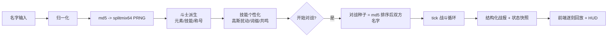
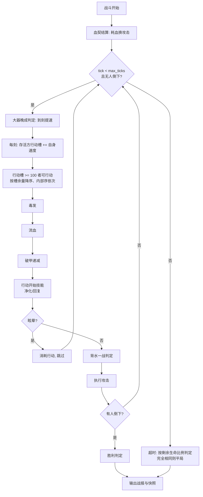

# 名字竞技场 · 完整规则与配置手册（GAME_SPEC）

> 本文档是游戏的**完整规则说明书**：流程图、全部细则与数值、每个 JSON 配置文件的
> 意义与调整指南。按 AGENTS.md 第 3.6 条，**每次更新涉及规则/数值/配置结构时必须
> 同步更新本文档**。当前版本：**v0.8.0**（与 `config/game/system.json` 的 `version` 一致）。

---

## 1. 总览

输入两个名字 → 名字 MD5 确定斗士的一切（元素/技能/称号/共鸣）→ 以 tick
推进的确定性回合对战。核心契约：**名字 + 配置不变 ⇒ 派生与对战结果永远不变**
（与进程、机器、请求次数、输入顺序无关）。

v0.5.0 起的设计原则：**属性与稀有度不再随机**（属性为固定基础值，稀有度系统
已删除），斗士间的强度差异完全来自技能组合、称号加成、技能个性化与共鸣；
**所有数值类随机一律服从高斯分布**（见 2.3）。



---

## 2. 随机体系

### 2.1 名字归一化

| 规则 | 当前值（`game/system.json` → `name`） |
| --- | --- |
| 去除首尾空白 `trim` | `true` |
| 大小写折叠 `case_sensitive` | `false`（`Alice` ≡ `alice`） |
| 最小/最大长度 | 1 / 32 |

归一化后为空 → 400 `empty_name`；超长 → 400 `name_too_long`。内部空格保留。

### 2.2 数值精度（v0.8.0 起）

- **后台不取整、保留全浮点**：个性化参数、共鸣系数、伤害、吸血、毒伤、流血、
  回血、HP 全程浮点运算（离散计数如持续次数仍为整数）；
- **展示层：百分数保留 2 位小数，其余数值保留整数**——
  `format_pct`（"13.02%"）/ `format_num`（"8"）；战报、HUD 与汇总同一规则
  （前端 `fmtPct` = `toFixed(2)+"%"`、`fmtInt` = `Math.round`）；
  快照中的 hp/atk/def/spd/crit/dodge/gauge 四舍五入到 2 位（仅数据精度，
  不影响内部运算，前端展示时再取整）。

### 2.3 抽样规则

- **离散选择**（选哪个元素/技能/称号结构/字段/词缀/共鸣来源与模式）：加权均匀抽取；
- **数值抽样**（技能数量、个性化扰动倍率、共鸣倍率、伤害浮动）：
  **高斯分布** `DetRng.next_gaussian(lo, hi)`——Box-Muller 变换（每次消耗两个
  均匀数），均值 = 区间中点，σ = 区间宽 ÷ 4，越界截断到区间；
  离散数值（技能数量）用 `next_gaussian_range`（±0.5 扩展后取整）。

### 2.4 派生主 PRNG 消耗顺序（固定，改变即 breaking）

种子：`md5(归一化名字)` → splitmix64。

1. 元素（加权抽取；仅身份标识，不影响数值）
2. 技能数量 k（**高斯**，[2, 3]）
3. 技能抽取（不放回加权，保持顺序）
4. 称号结构（加权）→ 称号字段（按结构顺序加权；core2 排除已用核心）
5. 称号字段加成叠加到固定属性（纯查表，不消耗随机数）
6. 战力 = Σ(属性 × 权重)

**属性为固定基础值（无随机）**；**稀有度系统已删除**。

---

## 3. 属性（`game/attributes.json`）

| 属性 | 基础值 base | 展示条范围 | 战力权重 |
| --- | --- | --- | --- |
| hp 生命 | 100 | 80–120 | 1 |
| atk 攻击 | 13 | 10–16 | 4 |
| def 防御 | 5 | 2–8 | 3 |
| spd 速度 | 10 | 6–14 | 2 |
| crit 暴击 | 12% | 5–20 | 2 |
| dodge 闪避 | 10% | 5–15 | 2 |

`min/max` 仅用于卡牌进度条展示；实际值 = base + 称号加成（下限 1）。
元素池：烈焰/洪流/青木/惊雷 权重 1，圣光/暗影 0.8（纯装饰）。

---

## 4. 技能体系

### 4.1 技能池（`game/skills.json` → `skills`）

每名斗士不放回抽取 **2–3** 个（高斯，2 更常见）。触发时机：`on_attack` /
`on_defense` / `on_turn_start` / `passive`。v0.8.0 起共 **27** 个技能
（12 个经典 + 15 个新技能），数值经 6000 场蒙特卡洛调参
（`tools/balance_check.py`，技能持有者胜率目标区间 45%–55%）。

**经典 12 技能**：

| 技能 | 触发 | 基础效果 |
| --- | --- | --- |
| 重击 heavy_strike | on_attack | 14% 概率，本次伤害 ×1.3 |
| 斩杀 execution | on_attack | 35% 概率，目标 HP≤35% 时伤害 ×2.4 |
| 嗜血 bloodthirst | on_attack | 伤害的 21% 转为生命 |
| 淬毒之刃 venom | on_attack | 30% 概率中毒：每次行动 2 点，持续 3 次 |
| 眩晕重锤 stun_blow | on_attack | 13% 概率眩晕（错过 1 次行动） |
| 连击 combo | on_attack | 24% 概率追加 50% 伤害一击 |
| 铁壁 iron_hide | on_defense | 受击伤害 -13% |
| 荆棘反甲 thorns | on_defense | 反弹 18% 所受伤害 |
| 疾风步 wind_step | passive | 闪避 +10 |
| 心眼 focus | passive | 暴击 +18 |
| 回春术 spring_heal | on_turn_start | 25% 概率回复 7 点 |
| 背水一战 last_stand | passive | HP<30% 时攻击 +25%（一次触发，持续到结束） |

**v0.8.0 新增 15 技能**（每个都有独立的机制设计而非数值拼凑）：

| 技能 | 触发 | 效果 | 设计意图 |
| --- | --- | --- | --- |
| 乘胜追击 momentum | on_attack | 连续命中每层伤害 +2.8%（至多 4 层），落空清零 | 连击节奏奖励，怕闪避 |
| 燃血轰击 overload | on_attack | 每次攻击消耗 11% 最大生命，本次伤害 ×1.3 | 高风险高爆发，赌命速攻 |
| 破甲连打 rupture | on_attack | 25% 概率击碎护甲：防御 −1（可叠 3 层），持续 3 次行动 | 持续削防，越打越疼 |
| 撕裂 lacerate | on_attack | 30% 概率流血：每动损失攻击者攻击 20% 的生命，持续 2 动 | 按攻击动态定伤的 DoT |
| 趁虚而入 exploit | on_attack | 敌方负面状态或即将行动（槽≥95%）时伤害 +50% | 抓时机、配合控制/破甲 |
| 疾影突袭 shadow_step | on_attack | 每次命中后行动槽额外 +14% | 出手频率压制 |
| 孤注一掷 all_in | on_attack | 35% 概率伤害 ×1.9，否则 ×0.7 | 高方差豪赌 |
| 坚守壁垒 bulwark | on_defense | 生命 ≥70% 时受伤 -30% | 前期强势、后期衰减 |
| 以牙还牙 retribution | on_defense | 被暴击时暴击率 +13%（至多 5 次） | 对暴击流的反制成长 |
| 不倒意志 iron_will | passive | 每场一次：致命伤害保留 1 点生命 | 保命翻盘 |
| 净化 purify | on_turn_start | 80% 概率解除中毒/流血并回复 7 点 | 反 DoT 克制技 |
| 大器晚成 late_bloom | passive | 第 40 刻起速度 +3.5 | 后期发力型 |
| 洞悉 true_sight | passive | 攻击无视敌方 42% 防御 | 破防被动 |
| 血契 blood_pact | passive | 开战消耗 10% 最大生命，攻击永久 +18% | 开局换血换输出 |
| 怨念深重 grudge | on_defense | 每次被命中 +1 层怨念：伤害 +2%/层（至多 3 层） | 挨打成长反击型 |

超模/弱势调参记录（初版 → 终版）：燃血轰击（+45% 伤害/3% 耗血）首测胜率 82.9%
→ 伤害 ×1.3、耗血 11%；趁虚而入初版 36.9%（触发率过低）→ 加入破甲与
「即将行动」条件；乘胜追击/怨念/背水/重击等成长与爆发类普遍下调
（后期伤害的胜率敏感度约为数值预期的 2 倍）。

### 4.2 个性化（`md5(名字:技能id)` 独立种子）

消耗顺序固定：**chance → value → damage → 前缀(是否→抽取) → 后缀(是否→抽取)
→ 共鸣(是否→来源→模式→变量→倍率)**。

- **方差扰动 `md5_variance`**（**高斯**）：概率 ×N(1.025, σ0.1625) 区间[0.7,1.35]
  （截断），数值 ×N(1.05, σ0.1) 区间[0.85,1.25]；概率截断到 [2%, 95%]；
- **名称词缀 `name_modifiers`**：前缀 50% / 后缀 40%；词缀对技能**已有参数**做
  小幅加法修正，且**修正值按名字个性化高斯缩放**（`mod_variance` = [0.7, 1.3]，
  即 ±30%）：

| 词缀 | 修正 | | 词缀 | 修正 |
| --- | --- | --- | --- | --- |
| 疾风(前) | 触发率 +3% | | 破军(后) | 效果值 +6% |
| 猛烈(前) | 效果值 +8% | | 蹈隙(后) | 触发率 +4% |
| 蚀骨(前) | 毒伤 +1 | | 入骨(后) | 毒伤 +1 |
| 缠绵(前) | 持续 +1 次 | | 不息(后) | 持续 +1 次 |
| 浩大(前) | 效果值 +5%、触发率 +2% | | 汹涌(后) | 效果值 +12%、触发率 -3% |

- **变量共鸣 `variable_link`**（可共鸣类型：重击/斩杀/连击/淬毒/眩晕/乘胜追击/
  燃血轰击/趁虚而入/孤注一掷/撕裂/破甲连打）：概率 **95%**；
  来源（己方 3 : 敌方 2）、模式（比例 3 : 差值 2）、变量、倍率（**高斯**）依次抽取。

**共鸣 v3（v0.6.0）：不改变技能逻辑，只按比例修正技能自身的某个参数**
（目标字段由 `variable_link.targets` 按效果类型指定，如 眩晕重锤 -> chance、
重击 -> value、淬毒之刃 -> damage），并以**基础值归一化**消除量纲差异：

```
共鸣系数 coeff（触发时刻按当前值动态计算）：
  比例模式：  coeff = rate × ( 源方[变量].当前值 ÷ 变量基础值 )
  差值模式：  coeff = rate × ( (己方[变量] − 敌方[参照]) ÷ 变量基础值 )   // 可为负
最终参数 = 基础参数 × (1 + coeff)，并按字段截断：
  chance ∈ [2%, 95%]；value ∈ [0.05, 5.0]；damage ≥ 0；turns ≥ 1（取整）
```

「当前值」：hp = 当前生命（动态），atk = 含背水一战，crit/dodge = 含被动，
def/spd = 面板；差值参照（`diff_against`）：攻↔防、速↔速、命↔命、暴击↔闪避等。
所有变量的倍率区间统一为 0.25–0.65（归一化后典型修正幅度 +25%–65%）。

| 变量 | 权重 | 倍率区间（高斯，归一化系数） | 差值参照 |
| --- | --- | --- | --- |
| atk | 3 | 0.25–0.65 | def |
| def | 2 | 0.25–0.65 | atk |
| spd | 3 | 0.25–0.65 | spd |
| hp | 2 | 0.25–0.65 | hp |
| crit | 1 | 0.25–0.65 | dodge |
| dodge | 1 | 0.25–0.65 | crit |

### 4.3 技能描述（标准化自然语言，v0.8.0 格式）

- **描述 = 一句自然语言**，由 `locale/stats.json` 的 `nat_<效果类型>` 模板 +
  个性化真实数值生成，单位随文（点/%/次行动）；
  例：「攻击时有 36% 概率使敌方中毒：其每次行动损失 2 点生命，持续 3 次行动。」；
- **共鸣描述 = 主句内联最简线性公式 + 尾句依赖描述**（v0.8.0 起）：
  公式化简为「基数 +（变量式）× 合并系数」（合并系数 = 基数 × 倍率 ÷ 变量基础值），
  变量一律以「当前」措辞描述。实例：
  「攻击时有 15.14% 概率使本次伤害提升至 231.52%（200.00% + 敌方当前生命× 0.82%）。
  敌方当前生命越高，效果值越高。」
  差值模式变量式为「（己方当前速度 − 敌方当前速度）」，尾句为
  「己方当前速度高于敌方当前速度越多，触发率越高。」；
- **对战实时技能数据**：卡牌/战报期间主句数值随双方当前快照实时变化
  （后端为每个共鸣技能提供 `live_text`（主句数值位为 `\u0001` 标记）与
  `link_calc = {base, coeff, mode, source, variable, against, clamp, fmt}`；
  前端按 `最终值 = base + 变量式 × coeff`（含上下限截断）逐刻重算，
  与引擎 `resonance_coeff + apply_resonance` 完全一致，有测试保障）；
- **简易显示模式**：前端开关（记忆在 localStorage），隐藏主句括号内的公式，
  尾句依赖描述保留；
- 技能名组装：`[前缀·]技能名[·后缀][·共鸣标记]`（标记：锋/坚/疾/命/锐/影），
  连接符 `link_sep`；风味短句（locale `skills.json` 的 `description`）作为副行展示。

---

## 5. 称号系统

| 结构 | 权重 | 字段 | 连接 | 示例 |
| --- | --- | --- | --- | --- |
| core | 20 | 核心 | — | 剑圣 |
| prefix_core | 26 | 前缀+核心 | （无） | 暗夜剑圣 |
| core_suffix | 22 | 核心+后缀 | · | 剑圣·无双 |
| dual_core | 18 | 核心+核心2 | · | 剑圣·酒仙 |
| full | 14 | 前缀+核心+后缀 | （无）/· | 血月剑圣·再临 |

字段池：前缀 ×10、核心 ×12、后缀 ×8（见 `game/titles.json`）。

**称号加成**（字段 `bonus`，叠加到固定属性）：

- 前缀：+1 单项（boundless 生命+2）
- 核心：+1 单项（war_god 攻+2、warlock 命+3、medic 命+4）
- 后缀：无双 攻+1暴+1 / 觉醒 暴+1闪+1 / 再临 命+3 / 传说 攻+2 / 亲卫 防+2 /
  见习 暴+1 / **候补 攻-1** / **退役 速-1 防+1**（负加成为刻意设计）

描述 = 字段描述片段以「，」连接 +「。」；卡牌另展示聚合加成行。

---

## 6. 战斗规则（tick 模型）

**种子**：`md5(排序后的双方规范化名字 以 \x1f 连接)`；内部序 = 速度降序、
名字升序（与输入顺序无关；镜像对战允许）。



### 攻击结算顺序

1. on_attack 技能逐个判定：共鸣修正参数（动态当前值）→ 掷触发 →
   倍率/吸血/中毒/眩晕/追击 + 新效果（乘胜层/燃血/豪赌/趁虚/破甲/撕裂/疾影槽）；
2. 怨念层加成（挨打积累的层数 × 每层加成计入本次倍率）；
3. 闪避判定（`rand < 敌方闪避%` → 落空，乘胜追击清零）；
4. 暴击判定 → **高斯**伤害浮动 → 伤害公式；
5. on_defense 技能：铁壁减伤、荆棘反甲（可致死）、坚守壁垒（高血量减伤）；
6. 结算伤害（**不倒意志**可挡一次致命伤保留 1 点）→ 命中反应
   （乘胜叠层 / 以牙还牙被暴击叠暴击 / 怨念叠层）→ 吸血/上毒/上流血/眩晕/疾影槽；
7. 追击（每段命中同样触发命中反应与不倒判定）。

**伤害公式**（全程浮点，不做中间取整；展示层百分数 2 位小数、其余取整）：

```
有效防御 = max(0, 敌方DEF − 破甲总量)
raw   = 有效ATK × 追击比例 × 高斯浮动(中心1.0, σ0.075, 截断[0.85,1.15]) × 暴击倍率(1.8) × 技能倍率
dmg   = max( 1, raw − 有效防御 × (1 − 攻击方穿透率) × 1.0 )
减伤后 = max( 1, dmg × (1 − 减伤率) )
```

**状态类规则**：毒/流血在拥有者行动时机结算（眩晕不影响），破甲层数同样随
受方行动递减到期清空；净化在行动开始时（有毒/血才掷骰）全部解除并回复；
血契/大器晚成为一次性结算（开战时 / 达到指定刻时）。

### 战斗常数（`game/battle.json`）

| 常数 | 值 |
| --- | --- |
| gauge_threshold | 100（行动槽阈值，每刻 += 速度） |
| max_ticks | 600 |
| crit_multiplier | 1.8 |
| variance | [0.85, 1.15]（高斯截断区间） |
| defense_factor / min_damage | 1.0 / 1 |
| crit_cap / dodge_cap | 100 / 60 |
| seed_separator | `\u001f` |

行动间隔 ≈ `100 ÷ 速度` 刻（速度 10 ≈ 每 10 刻；称号 ±1 速度带来节奏差异）。

---

## 7. 战报与状态快照

条目：`{tick, template, params, state, text}`。`params` 中技能/属性/措辞以
`{"ref": 注册名, "id": 条目id}` 传递（注册名：skill/element/attr/stat_word），
渲染时查 locale。`state` 按输入位置 a/b，含
`{hp, max_hp, atk(有效), def(破甲后), spd, crit, dodge, gauge(0-100),
buffs:[{id,name,detail,desc}]}`（v0.8.0 起补 crit/dodge，供前端实时技能公式取值）；
buff 集合（16 种）：poison / bleed / stun / shred / last_stand / momentum /
grudge / retribution / crit_up / dodge_up / pen_up / blood_pact / iron_will /
iron_will_used / tempo / tempo_up。

前端逐刻回放：每 `TICK_MS(255ms) ÷ 倍速` 推进一刻（v0.6.0 起为原速的 1/3）；行动槽每刻 +速度%
（客户端模拟 + 快照校正）；条目在其所属刻揭示；共鸣技能卡数值按快照实时重算
（数值变化时闪烁提示）。

---

## 8. API

| 接口 | 说明 |
| --- | --- |
| `GET /api/health` | `{status, version}` |
| `GET /api/text?lang=zh` | UI 全部文案 + 语言列表 + 版本 |
| `GET /api/fighter?name=X&lang=zh` | 斗士数据（属性、自然语言技能描述、称号加成、共鸣公式） |
| `POST /api/battle` | `{a,b,lang}` → 双方 + 逐条战报（含快照）+ 胜负 |
| `POST /api/battle/fast` | `{a,b,runs}` 或 `{pairs:[[a,b],...],runs}` → 极速结果（无快照/无文案渲染，含耗时 ms；实测约 0.25ms/场） |

错误码：empty_name / name_too_long / unknown_locale / bad_request / not_found / internal_error。

---

## 9. `config/game/*.json` 调整指南（共 6 个文件）

### system.json —— 全局
`version`（更新时同步）、`default_locale`、`available_locales`、
`name{trim,case_sensitive,min_length,max_length}`。
示例：大小写敏感 → `"case_sensitive": true`（**breaking**）。

### attributes.json —— 属性（固定值）
`attributes[] {id, base, min, max, format, power_weight}`：`base` 为固定基础值，
`min/max` 仅用于卡牌进度条；引擎必需 id：hp/atk/def/spd/crit/dodge。
示例：全体提速 → `"base": 12`（影响所有名字的战斗节奏，breaking）。

### elements.json —— 元素池
`elements[] {id,weight}`，纯身份标识。新增元素需同步双语言 locale。

### skills.json —— 技能池与个性化
- `skill_count{min,max}`；
- `skills[] {id,weight,trigger,effect}`（`effect.type` 须为引擎已支持的 26 种；
  伤害倍率类可带 `condition`）；
- `md5_variance{chance[lo,hi], value[lo,hi]}`：高斯扰动区间（σ = 宽/4）；
- `variable_link`：`chance` / `linkable_types`（11 种 on_attack 类效果可共鸣）/
  `source_weights` / `mode_weights` / `targets{效果类型→参数字段}` /
  `variables{id→{weight, rate[lo,hi], diff_against}}`；
- `name_modifiers`：`prefix_chance` / `suffix_chance` / `mod_variance` /
  `prefixes[]` / `suffixes[]`（`mod` 键限定 chance/value/damage/turns）。

示例：共鸣必发且全差值 → `"chance": 1.0, "mode_weights": {"ratio":1,"difference":4}`。

**调平衡**：改数值/权重后运行 `python tools/balance_check.py [名字数] [对局数]`
（固定种子蒙特卡洛），检查各技能持有者胜率是否回到 45%–55% 区间。

### titles.json —— 称号
`structures[] {id,weight,fields[],connectors[]}`（字段限定 prefix/core/core2/suffix）
与 `prefixes/cores/suffixes[] {id,weight,bonus{属性:增量}}`。

### battle.json —— 战斗常数
见第 6 节表。示例：更快战斗 → `"gauge_threshold": 80`。

---

## 10. `config/locales/<lang>/*.json` 调整指南（共 9 个文件）

| 文件 | 内容 | 注意 |
| --- | --- | --- |
| ui.json | 全部界面文案（含错误码、称号加成标签） | 各语言键集合必须一致（有测试） |
| attributes.json | 属性显示名 | 覆盖全部属性 id |
| elements.json | 元素名 + emoji | 覆盖全部元素 id |
| skills.json | 技能名 + 风味短句 `description` | 覆盖全部技能 id；数值不写在这里 |
| titles.json | 称号字段 name/desc | 覆盖全部字段 id |
| stats.json | 自然语言模板 `nat_*`（27 种效果）、最简公式 `link_formula`（`{base} + {expr}× {merged}`）、差值变量式 `link_expr_difference`、当前措辞 `current_word`、共鸣句式 `link_ratio`/`link_difference`、共鸣标记 `link_*`、来源/模式词、字段名 `field_*`、词缀修正模板 `mod_*`、连接符 `link_sep` | 占位符如 `{chance}` `{stat}` `{merged}` |
| buffs.json | buff 的 name/detail/desc | 覆盖引擎 16 种 buff id |
| modifiers.json | 词缀名称 | 覆盖全部词缀 id |
| battle_log.json | 全部战报模板 | 覆盖引擎全部模板 id（有测试） |

新增语言：复制 `locales/zh/` 九个文件翻译，加入 `available_locales`，重启生效。

---

## 11. 前端行为要点

- 逐刻回放（255ms/刻 ÷ 倍速）；行动槽每刻推进、满槽揭示该刻条目并按快照回落；
- HUD：HP/攻防速/行动槽/buff 徽章；背水一战攻击高亮；buff 差量刷新；
- **展示精度**：百分数 2 位小数（`fmtPct`），其余数值整数（`fmtInt`）——
  与后端 `format_pct` / `format_num` 同一规则；
- **对战实时技能数据**：共鸣技能卡的主句数值按双方快照逐刻重算
  （`link_calc` 公式 + `\u0001` 标记替换），数值变化时卡牌闪烁；
- **简易显示模式**：页眉开关（记忆 localStorage），隐藏技能描述中的共鸣公式；
  切换后实时数值保持（按最近快照恢复）；
- 技能卡：自然语言描述（含共鸣句式与公式）为主行，风味短句为副行；
  悬停显示完整说明与词缀明细；
- 全部文案来自 `/api/text` 与 API 响应，前端零硬编码文案。

---

## 12. 数值速查（v0.8.0）

- 属性固定：HP 100 / ATK 13 / DEF 5 / SPD 10 / CRIT 12% / DODGE 10%（+称号加成）
- 技能 27 个、每名斗士 2–3 个（高斯）；共鸣概率 95%（修正技能自身参数，
  归一化 0.25–0.65，11 种 on_attack 效果可共鸣）；
  词缀 前缀 50% / 后缀 40%（修正值高斯缩放 [0.7, 1.3]）
- 数值类随机全部高斯（σ = 区间宽 ÷ 4，截断区间）
- 行动槽 100 / 最大 600 刻 / 暴击 ×1.8 / 高斯浮动 ±15%（截断）/ 伤害下限 1
- 回放 255ms/刻（原速 1/3）；极速接口 /api/battle/fast ≈ 0.2ms/场
- 数值精度：后台全浮点；展示层百分数 2 位小数、其余数值整数
- 暴击上限 100%、闪避上限 60%；毒/流血按行动结算、眩晕消耗一次行动、
  破甲随受方行动递减；不倒意志每场一次挡致命伤
- 超时：按剩余生命比例判定，完全相同则平局
- 平衡基线：6000 场蒙特卡洛下技能持有者胜率 43%–57%（tools/balance_check.py）
