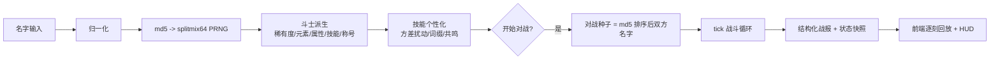
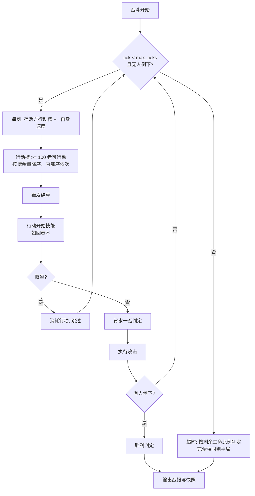

# 名字竞技场 · 完整规则与配置手册（GAME_SPEC）

> 本文档是游戏的**完整规则说明书**：流程图、全部细则与数值、每个 JSON 配置文件的
> 意义与调整指南。按 AGENTS.md 第 3.7 条，**每次更新涉及规则/数值/配置结构时必须
> 同步更新本文档**。当前版本：**v0.4.0**（与 `config/game/system.json` 的 `version` 一致）。

---

## 1. 总览

输入两个名字 → 名字 MD5 确定斗士的一切（属性/技能/称号/元素/稀有度）→ 以 tick
推进的确定性回合对战。核心契约：**名字 + 配置不变 ⇒ 派生与对战结果永远不变**
（与进程、机器、请求次数、输入顺序无关）。



---

## 2. 名字归一化

| 规则 | 当前值（`game/system.json` → `name`） |
| --- | --- |
| 去除首尾空白 `trim` | `true` |
| 大小写折叠 `case_sensitive` | `false`（`Alice` ≡ `alice`） |
| 最小长度 `min_length` | 1 |
| 最大长度 `max_length` | 32 |

归一化后为空 → 400 `empty_name`；超长 → 400 `name_too_long`。
内部空格保留（`张 三` ≠ `张三`）。

---

## 3. 斗士派生

**种子**：`md5(归一化名字的 UTF-8 字节)` 的十六进制转整数，喂给 splitmix64
（`namefight/rng.py`，纯整数运算、跨平台一致，金向量测试锁定算法）。

**主 PRNG 消耗顺序（固定，改变即 breaking）**：

1. 稀有度（按权重抽一个）
2. 元素（按权重抽一个）
3. 六维属性（按配置顺序，各自在 [min, max] 内取整）
4. 稀有度倍率（对 `scaled_attributes` 中的属性 ×倍率后取整，至少 1）
5. 技能数量 k（[min, max] 内取整）
6. 技能抽取（不放回按权重抽 k 个，保持抽取顺序）
7. 称号结构（按权重抽一个）
8. 称号字段（按结构字段顺序逐个按权重抽；`core2` 从核心池排除已用的 core）
9. 称号字段加成（纯查表叠加到属性，至少 1；**不消耗随机数**）
10. 战力 = Σ(属性值 × 权重)，四舍五入

### 属性表（`game/attributes.json`）

| 属性 | 区间 | 展示 | 战力权重 |
| --- | --- | --- | --- |
| hp 生命 | 80–120 | 整数 | 1 |
| atk 攻击 | 10–16 | 整数 | 4 |
| def 防御 | 2–8 | 整数 | 3 |
| spd 速度 | 6–14 | 整数 | 2 |
| crit 暴击 | 5–20 | 百分比 | 2 |
| dodge 闪避 | 5–15 | 百分比 | 2 |

### 稀有度（`game/rarities.json`）

| 稀有度 | 权重 | 星级 | hp 倍率 | atk 倍率 |
| --- | --- | --- | --- | --- |
| 凡品 common | 55 | ★ | 1.00 | 1.00 |
| 稀有 rare | 26 | ★★ | 1.08 | 1.06 |
| 史诗 epic | 14 | ★★★ | 1.16 | 1.12 |
| 传说 legendary | 5 | ★★★★ | 1.25 | 1.20 |

### 元素（`game/elements.json`）

仅身份标识（卡片徽章/开场播报），**不参与任何数值计算**：
烈焰/洪流/青木/惊雷 权重 1，圣光/暗影 权重 0.8。

---

## 4. 技能体系

### 4.1 技能池（`game/skills.json` → `skills`）

每名斗士按权重不放回抽取 **2–3** 个（`skill_count`）。12 个技能的触发时机：
`on_attack`（攻击时）/ `on_defense`（受击时）/ `on_turn_start`（行动开始）/
`passive`（常驻）。

| 技能 | 触发 | 基础效果 |
| --- | --- | --- |
| 重击 heavy_strike | on_attack | 18% 概率，本次伤害 ×1.6 |
| 斩杀 execution | on_attack | 30% 概率，目标 HP≤35% 时伤害 ×2.0 |
| 嗜血 bloodthirst | on_attack | 伤害的 25% 转为生命 |
| 淬毒之刃 venom | on_attack | 30% 概率中毒：每次行动 2 点，持续 3 次 |
| 眩晕重锤 stun_blow | on_attack | 12% 概率眩晕（跳过下次行动） |
| 连击 combo | on_attack | 22% 概率追加 50% 伤害一击 |
| 铁壁 iron_hide | on_defense | 受击伤害 -20% |
| 荆棘反甲 thorns | on_defense | 反弹 30% 所受伤害 |
| 疾风步 wind_step | passive | 闪避 +8 |
| 心眼 focus | passive | 暴击 +10 |
| 回春术 spring_heal | on_turn_start | 25% 概率回复 6 点 |
| 背水一战 last_stand | passive | HP<30% 时攻击 +50%（一次触发，持续到战斗结束） |

### 4.2 个性化（`md5(名字:技能id)` 独立种子，与主派生流互不影响）

消耗顺序固定：**chance → value → damage → 前缀(是否→抽取) → 后缀(是否→抽取)
→ 共鸣(是否→来源→模式→变量→倍率)**。

**① 方差扰动 `md5_variance`**：概率 ×[0.7, 1.35]（截断到 [2%, 95%]），
数值（value/damage）×[0.85, 1.25]。

**② 名称词缀 `name_modifiers`**：前缀 50% / 后缀 40% 概率获得；词缀对技能
**已有参数**做小幅加法修正（chance 截断 [2%, 95%]，turns 至少 1）：

| 词缀 | 修正 | | 词缀 | 修正 |
| --- | --- | --- | --- | --- |
| 疾风(前) | 触发率 +3% | | 破军(后) | 效果值 +6% |
| 猛烈(前) | 效果值 +8% | | 蹈隙(后) | 触发率 +4% |
| 蚀骨(前) | 毒伤 +1 | | 入骨(后) | 毒伤 +1 |
| 缠绵(前) | 持续 +1 次 | | 不息(后) | 持续 +1 次 |
| 浩大(前) | 效果值 +5%、触发率 +2% | | 汹涌(后) | 效果值 +12%、触发率 -3% |

**③ 变量共鸣 `variable_link`**（仅 `linkable_types`：重击/斩杀/连击/淬毒/眩晕）：
获得共鸣的概率 **95%**；来源按权重（己方 3 : 敌方 2）、模式按权重（比例 3 : 差值 2）、
变量按权重抽取，倍率在变量区间内均匀抽取。

**共鸣计算公式（触发时刻动态求值）**：

```
比例模式：  bonus = round( 源方[变量].当前值 × rate )
差值模式：  bonus = round( ( 己方[变量].当前值 − 敌方[参照属性].当前值 ) × rate )
bonus = max(0, bonus)        // 差值为负时不提供加成
```

- 「当前值」：hp = 当前生命（随战斗动态变化），atk = 含背水一战的有效攻击，
  crit/dodge = 含被动加成，def/spd = 面板值；
- 差值参照 `diff_against`（有意义的配对）：攻↔防、防↔攻、速↔速、命↔命、暴击↔闪避、闪避↔暴击；
- 淬毒类技能的共鸣加在**毒伤**上，其余加在**本次打击伤害**上；
- 展示：技能名后缀标记（·锋=攻 ·坚=防 ·疾=速 ·命=命 ·锐=暴击 ·影=闪避）；
  卡牌参数行给出公式（`共鸣：己方攻击（比例）× 70%`），己方+比例模式另给开战参考值。

| 变量 | 权重 | 倍率区间 | 差值参照 |
| --- | --- | --- | --- |
| atk 攻击 | 3 | 0.35–0.80 | def |
| def 防御 | 2 | 0.50–1.50 | atk |
| spd 速度 | 3 | 0.40–0.90 | spd |
| hp 生命 | 2 | 0.04–0.10 | hp |
| crit 暴击 | 1 | 0.10–0.35 | dodge |
| dodge 闪避 | 1 | 0.20–0.50 | crit |

### 4.3 完整技能名组装顺序

`[前缀·]技能名[·后缀][·共鸣标记]`，连接符 `·`（locale `stats.json` 的 `link_sep`）。
示例：`疾风·重击·破军·命`。

---

## 5. 称号系统

**两级概率生成**（`game/titles.json`）：

| 结构 | 权重 | 字段 | 连接 | 示例 |
| --- | --- | --- | --- | --- |
| core | 20 | 核心 | — | 剑圣 |
| prefix_core | 26 | 前缀+核心 | （无） | 暗夜剑圣 |
| core_suffix | 22 | 核心+后缀 | · | 剑圣·无双 |
| dual_core | 18 | 核心+核心2 | · | 剑圣·酒仙 |
| full | 14 | 前缀+核心+后缀 | （无）/· | 血月剑圣·再临 |

字段池：前缀 ×10（暗夜/血月/深渊/苍穹/烈焰/寒霜/雷霆/无极/孤高/缄默）、
核心 ×12（剑圣/拳王/术士/狂战/刺客/贤者/游侠/武神/酒仙/幻影/神医/赌徒）、
后缀 ×8（无双/觉醒/再临/传说/亲卫/见习/候补/退役）。

**称号加成**（字段 `bonus`，在稀有度倍率后叠加，属性至少 1）：

- 前缀：+1 单项（boundless 生命+2）
- 核心：+1 单项（war_god 攻击+2、warlock/medic 生命+3/4）
- 后缀：无双 攻+1暴+1 / 觉醒 暴+1闪+1 / 再临 命+3 / 传说 攻+2 / 亲卫 防+2 /
  见习 暴+1 / **候补 攻-1** / **退役 速-1 防+1**（负加成为刻意设计）

显示名按结构连接符拼接；描述 = 各字段描述片段以「，」连接 +「。」
（例：「生性孤高，禁忌术士，勉强候补。」）。

---

## 6. 战斗规则（tick 模型）

**种子**：`md5(排序后的双方规范化名字 以 \x1f 连接)`；先后手内部序 =
速度降序、名字升序（与输入顺序无关；镜像对战允许）。



### 攻击结算顺序（每次行动）

1. 攻击方 on_attack 技能逐个判定（按技能顺序）：触发 → 共鸣附伤（动态计算）
   → 伤害倍率/吸血/中毒/眩晕/追击标记；
2. 闪避判定：`rand < 敌方闪避%` → 落空（跳过后续）；
3. 暴击判定 → 伤害浮动 → 伤害公式；
4. 防守方 on_defense 技能：减伤（先乘后取整，下限 1）、反甲（反弹给攻击者，可致死）；
5. 结算伤害与吸血（上限当前最大生命）、上毒/眩晕；
6. 追击（可再次被闪避/暴击）。

**伤害公式**：

```
raw   = 有效ATK × 追击比例 × 浮动[0.85,1.15] × 暴击倍率(1.8) × 技能倍率 × 1
dmg   = max( 1, round( raw + 共鸣附伤 − 敌方DEF × 防御系数(1.0) ) )
减伤后 = max( 1, round( dmg × (1 − 减伤率) ) )
```

### 战斗常数（`game/battle.json`）

| 常数 | 值 | 含义 |
| --- | --- | --- |
| gauge_threshold | 100 | 行动槽阈值；每刻 += 速度值 |
| max_ticks | 600 | 超时判定前的最大刻数 |
| crit_multiplier | 1.8 | 暴击伤害倍率 |
| variance | [0.85, 1.15] | 伤害浮动区间 |
| defense_factor | 1.0 | DEF 减伤系数 |
| min_damage | 1 | 单次伤害下限 |
| crit_cap / dodge_cap | 100 / 60 | 暴击/闪避上限（百分数） |
| seed_separator | `\u001f` | 对战种子连接符 |

速度与出手频率：行动间隔 ≈ `100 ÷ 速度` 刻（速度 12 ≈ 每 9 刻一次，
速度 9 ≈ 每 12 刻一次）；同一刻双方均可行动时按槽余量降序执行。

---

## 7. 战报与状态快照

战报条目：`{tick, template, params, state, text}`。

- `template` + `params`：结构化事件（语言无关）；`params` 中技能/属性/共鸣措辞以
  `{"ref": 注册名, "id": 条目id}` 传递，渲染时查 locale；
- `state`：`{"a": 快照, "b": 快照}`（按输入位置），快照 =
  `{hp, max_hp, atk(有效), def, spd, gauge(0-100), buffs:[{id,name,detail,desc}]}`；
- buff 集合：poison / stun / last_stand / crit_up / dodge_up。

前端逐刻回放：每 `TICK_MS(85ms) ÷ 倍速` 推进一刻，行动槽每刻 +速度%（客户端模拟，
快照校正），条目在其所属刻到达时揭示——直观呈现双方真实攻击间隔。

---

## 8. API

| 接口 | 说明 |
| --- | --- |
| `GET /api/health` | `{status, version}` |
| `GET /api/text?lang=zh` | UI 全部文案 + 语言列表 + 版本 |
| `GET /api/fighter?name=X&lang=zh` | 斗士数据（含称号加成、词缀技能名、共鸣公式） |
| `POST /api/battle` | `{a,b,lang}` → 双方 + 逐条战报（含快照）+ 胜负 |

错误：`{"error": code}` + 4xx（empty_name / name_too_long / unknown_locale / bad_request / not_found / internal_error）。

---

## 9. `config/game/*.json` 调整指南（数值与规则）

### system.json —— 全局
键：`version`（版本号，更新时同步）、`default_locale`、`available_locales`、
`name{trim,case_sensitive,min_length,max_length}`。
示例：想让大小写敏感 → `"case_sensitive": true`（**会改变同名结果，breaking**）。

### attributes.json —— 属性区间
键：`attributes[] {id,min,max,format,power_weight}`；引擎必需 id：
hp/atk/def/spd/crit/dodge。
示例：提高暴击上限 → `{"id":"crit","min":5,"max":30,...}`。

### elements.json —— 元素池
键：`elements[] {id,weight}`。纯身份标识。
示例：新增元素 → 加 `{"id":"ice","weight":1}` + 双语言 `elements.json` 补
`{"name":"寒冰","emoji":"🧊"}`。

### rarities.json —— 稀有度
键：`scaled_attributes`（受倍率影响的属性）、`rarities[] {id,weight,stars,multipliers}`。
示例：新增档位 → 加 `{"id":"mythic","weight":1,"stars":5,"multipliers":{"hp":1.35,"atk":1.3}}`。

### skills.json —— 技能池与个性化
四个区段：
- `skill_count{min,max}`：每人技能数（1 ≤ min ≤ max ≤ 池大小）；
- `skills[] {id,weight,trigger,effect}`：`effect.type` 必须是引擎已支持的
  12 种（damage_multiplier/lifesteal/poison/stun/extra_strikes/damage_reduction/
  reflect/dodge_bonus/crit_bonus/heal/low_hp_atk_bonus）；伤害倍率类可带
  `condition{type:"target_hp_below",value}`；
- `md5_variance{chance[lo,hi], value[lo,hi]}`：个性化扰动倍率区间；
- `variable_link`：共鸣（`chance`、`linkable_types`、`source_weights`、
  `mode_weights`、`variables{id→{weight,rate[lo,hi],diff_against}}`）；
- `name_modifiers`：词缀（`prefix_chance`、`suffix_chance`、`prefixes[]`、
  `suffixes[]`，`mod` 的键限定 chance/value/damage/turns，仅作用于技能已有参数）。

示例：共鸣更凶 → `"chance": 1.0`、`"mode_weights": {"ratio":1,"difference":4}`。

### titles.json —— 称号
键：`structures[] {id,weight,fields[],connectors[]}`（字段名限定
prefix/core/core2/suffix；connectors 长度 = 字段数−1）、
`prefixes[]/cores[]/suffixes[] {id,weight,bonus{属性:增量}}`。
示例：后缀更慷慨 → 把 `substitute` 的 `bonus` 改为 `{"atk": 1}`。

### battle.json —— 战斗常数
键见第 6 节常数表。示例：更快的战斗 → `"gauge_threshold": 80`。

---

## 10. `config/locales/<lang>/*.json` 调整指南（文案，共 10 个文件）

| 文件 | 内容 | 注意 |
| --- | --- | --- |
| ui.json | 全部界面文案（含错误码、称号加成标签） | 所有语言的键集合必须一致（有测试） |
| attributes.json | 属性显示名 | 覆盖全部属性 id |
| elements.json | 元素名 + emoji | 覆盖全部元素 id |
| rarities.json | 稀有度名 | 覆盖全部稀有度 id |
| skills.json | 技能名/风味描述 `description`/机制描述 `detail` | 覆盖全部技能 id；数值不写在这里 |
| titles.json | 称号字段 `prefixes/cores/suffixes` 的 name/desc | 覆盖全部字段 id |
| stats.json | 技能参数标签、共鸣标记（`link_*`）、词缀修正（`mod_*`）、来源/模式词（`scope_*`/`mode_*`）、名称连接符 `link_sep` | 占位符 `{v}`/`{stat}` 等 |
| buffs.json | buff 的 name/detail（带参）/desc | 覆盖引擎 5 种 buff id |
| modifiers.json | 词缀名称 `prefixes/suffixes` | 覆盖全部词缀 id |
| battle_log.json | 全部战报模板 | 覆盖引擎全部模板 id（有测试） |

新增语言：复制 `locales/zh/` 十个文件翻译，`system.json` 的
`available_locales` 加代码，重启生效。

---

## 11. 前端行为要点

- **逐刻回放**：tick 时钟（85ms/刻 ÷ 倍速）驱动；行动槽每刻 +速度%、满槽揭示
  该刻战报条目并按快照回落；跳过=瞬时；
- **HUD**：HP 条/攻防速/行动槽/buff 徽章随快照更新；背水一战时攻击高亮；
  buff 差量刷新（集合不变不重建）；
- **悬停详情**：技能 tooltip = 机制描述 + 风味文本 + 词缀修正 + 参数行；
  buff tooltip = 当前数值 + 机制说明；
- 全部文案来自 `/api/text` 与 API 响应，前端零硬编码文案。

---

## 12. 数值速查（当前值）

- 属性：HP 80–120 / ATK 10–16 / DEF 2–8 / SPD 6–14 / CRIT 5–20% / DODGE 5–15%
- 技能数 2–3；共鸣概率 95%；词缀 前缀 50% / 后缀 40%
- 行动槽 100 / 最大 600 刻 / 暴击 ×1.8 / 浮动 ±15% / 伤害下限 1
- 暴击上限 100%、闪避上限 60%；中毒按行动结算、眩晕消耗一次行动
- 超时：按剩余生命比例判定，完全相同则平局
